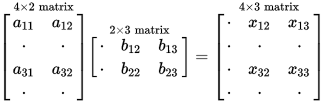

In this assignment, we'll explore one way to make a [recommender system](https://en.wikipedia.org/wiki/Recommender_system), something which predicts the rating a user would give to some item. Specifically, we'll be using [collaborative filtering](https://en.wikipedia.org/wiki/Collaborative_filtering) on the [MovieLens 1M Dataset](http://grouplens.org/datasets/movielens/), a set of one million different movie ratings. Collaborative filtering operates on the assumption that if one person $A$ has the same opinion as another person $B$ on item $X$, A is *also* more likely to have the same opinion as $B$ on a *different* item $Y$ than to have the opinion of a randomly chosen person on $Y$.

Collaborative filtering is a type of [unsupervised learning](https://en.wikipedia.org/wiki/Unsupervised_learning) and can serve as a *prelude* to dimensionality reduction (*e.g.*, with PCA or factor analysis) because filling in missing values is typically required for such methods. Specifically, we will be working with an [imputation](https://en.wikipedia.org/wiki/Imputation_(statistics))-based method of collaborative filtering, which infers *all* of the missing values from the given data.

In the following, write up your work in an R Markdown file with elaboration about *what* you're doing at each step and *why* you're doing it. Include interpretation of results as well whenever appropriate. Your goal should be to produce, at the end, an HTML (or PDF) file from the R Markdown writeup that gives a coherent and reasonably accessible description of the process you followed, the reasoning behind each step, and the results attained at the end.

Getting started
===============

We'll first need to spend some time preparing the data before we can use any collaborative filtering methods.

* Download the [MovieLens 1M Dataset](http://grouplens.org/datasets/movielens/1m/). Read the associated [`README.txt`](http://files.grouplens.org/datasets/movielens/ml-1m-README.txt), which describes the contents of the dataset.

* The first 5 lines of `ratings.dat` are:

	```
	1::1193::5::978300760
	1::661::3::978302109
	1::914::3::978301968
	1::3408::4::978300275
	1::2355::5::978824291
	```

	Use [`read.csv()`](https://stat.ethz.ch/R-manual/R-devel/library/utils/html/read.table.html) with the appropriate options to load the file into R. The resulting data frame should have **1000209 rows** and **7 columns**.

* Restrict to the columns containing user IDs, movie IDs, and movie ratings. Name the columns appropriately.

* Compute the sets of [`unique()`](https://stat.ethz.ch/R-manual/R-devel/library/base/html/unique.html) user IDs and movie IDs as well as the mean rating given. Compare the numbers of different user IDs and movie IDs with the *maximum* user ID and movie ID.

* Set the seed to **3** for consistency. Generate a training set using 80% of the data and a test set with the remaining 20%.

Because there are some movies which are rated by very few people and some people who rated very few movies, we have two corresponding problems: (1) there will be movies in the test set which were not rated by any people in the training set and (2) there will be people in the test set who do not show up in the training set. As such, we need to add to the training set a fake movie rated by every user and a fake user who rated every movie.

* Create two data frames corresponding to the above fake data using the previously calculated mean rating. (For the fake movie and user respectively, use a movie ID and user ID which are both 1 greater than their respective maximum values in the entire dataset.) When creating the fake user who has rated every movie, allow the movie IDs to range from 1 to the maximum movie ID in the dataset (which will include movie IDs not present in the dataset). The fake user should not have a rating for the fake movie.

* Perturb the ratings of the fake data slightly by adding a normally distributed noise term with mean 0 and standard deviation 0.01. Add your fake data to the training data frame, which should increase in size by **9994 rows**.

Next, we need to create a matrix containing rating data for (user, movie) pairs. We can store this as a *sparse* matrix, which is a special data structure designed for handling matrices where only a minority of the entries are filled in (because each user has only rated a small number of movies).

* Use `Incomplete()` to generate a sparse ratings matrix with one row per user ID and one column per movie ID. The resulting matrix should have **6041 rows** and **3953 columns**.

Alternating least squares imputation
====================================

We will proceed to use the method of alternating least squares (ALS) to impute the missing entries in the sparse ratings matrix.[^als]

[^als]: Hastie *et al.* (2014), [Matrix Completion and Low-Rank SVD via Fast Alternating Least Squares](http://arxiv.org/abs/1410.2596).

Theoretical explanation
-----------------------

The operation of [matrix multiplication](https://en.wikipedia.org/wiki/Matrix_multiplication) allows us to *multiply* two matrices and form a new matrix. It is illustrated below:

{width=50%}

Note specifically the dimensions of the resulting matrix. If $\textbf{A}$ is an $n \times p$ matrix and $\textbf{B}$ is a $p \times m$ matrix, the product $\textbf{A}\textbf{B}$ will have dimensions $n \times m$.[^dim] What if $p$ is very small compared to $n$ and $m$? We will be able to obtain quite a large matrix just from multiplying together two very narrow matrices (one tall and one wide).

[^dim]: If the matrices all have real values, we can write $\textbf{A} \in \mathbb{R}^{n \times p}$, etc.

In general, we find that it is possible to [decompose](https://en.wikipedia.org/wiki/Matrix_decomposition) large matrices into the *product* of multiple *smaller* matrices. This is the key behind the method of alternating least squares.

The task at hand is that given a matrix $\textbf{X}$ with many missing entries, we want to construct a filled-in matrix $\textbf{Z}$ which *minimizes some loss function*. It turns out that we can write a *regularized* cost function which makes this task straightforward, and also that we can write the solution which minimizes the cost function as

$$\textbf{Z} = \textbf{X} + \textbf{A} \textbf{B}^\intercal$$

for an appropriate choice of a quite tall matrix $\textbf{A}$ and a wide matrix $\textbf{B}$.[^ab] The operator $\intercal$ denotes the *transpose* of a matrix, where we flip a $n \times m$ matrix so that its dimensions become $m \times n$. Instead of *directly* imputing $\textbf{X}$, we are essentially considering the "optimal" filled-in matrix $\textbf{Z}$ and *implicitly* imputing the *differences* between $\textbf{X}$ and $\textbf{Z}$ (given by $\textbf{A} \textbf{B}^\intercal$) by trying to minimize the differences between the filled-in entries of $\textbf{X}$ and the corresponding entries of $\textbf{A} \textbf{B}^\intercal$ (along with a regularization term).[^deg]

[^ab]: We take the sum only of (1) non-missing entries of $\textbf{X}$ and (2) entries in $\textbf{A} \textbf{B}^\intercal$ which do *not* correspond to non-missing entries of $\textbf{X}$. Essentially the matrix $\textbf{A} \textbf{B}^\intercal$ is only used to estimate missing values in $\textbf{X}$.

[^deg]: One can ask the question of why we don't simply estimate $\textbf{A} = \textbf{B} = \textbf{0}$ in the degenerate case of $\textbf{X}$ having *no* missing values. If that were the result, it would contradict the fact that $\textbf{A} \textbf{B}^\intercal$ should be equal to the soft-thresholded SVD of $\textbf{Z}$ (presented later in this exposition)! The reason is that although $\textbf{A} \textbf{B}^\intercal$ contains information about the *differences* between $\textbf{X}$ and $\textbf{Z}$, we don't try to impute those differences directly (in which case we might stop immediately if there were no differences whatsoever) but rather *infer* them by trying to bring $\textbf{X}$ and $\textbf{A} \textbf{B}^\intercal$ closer together.

Our task is now simply to estimate the matrices $\textbf{A}$ and $\textbf{B}$. It turns out that the optimal estimates are related via the equation[^ridge]

[^ridge]: Notice that this is actually equivalent to using [Tihkonov regularized linear regression](https://en.wikipedia.org/wiki/Tikhonov_regularization) with Tikhonov matrix $\Gamma = \left( \lambda \textbf{I} \right)^{1/2}$. This is also called *ridge regression* and reduces to $L^2$ regularization in the case where $\Gamma$ is the identity matrix. We are essentially running a linear regression of each column of $\textbf{Z}$ with the columns of $\textbf{B}$ as predictors and getting $\textbf{A}$ back as the coefficient estimates.

$$\textbf{A} = \left( \textbf{B}^\intercal \textbf{B} + \lambda \textbf{I} \right)^{-1} \textbf{B}^\intercal \textbf{Z}$$

and vice versa with $\textbf{A}$ and $\textbf{B}$ switched, where $\lambda$ is the regularization parameter and $\textbf{I}$ is the identity matrix.[^iden]

[^iden]: The identity matrix is a matrix with 1 on the diagonal and 0 elsewhere. Multiplying it by a different matrix leaves that matrix unchanged.

As such, this suggests a strategy where we start by initializing $\textbf{A}$ and $\textbf{B}$ and then repeatedly use one to estimate the other and vice versa (hence the name of *alternating* least squares), updating the filled-in matrix $\textbf{Z}$ at each step via $\textbf{Z} = \textbf{X} + \textbf{A} \textbf{B}^\intercal$ and iterating until convergence.

At the end, the algorithm returns the imputed matrix $\textbf{Z}$, but in a *special form*. It turns out that the product $\textbf{A} \textbf{B}^\intercal$ is related to $\textbf{Z}$ in yet another fashion. Taking a step back: in general, *all* matrices can be decomposed into a product of the form $\textbf{U} \textbf{D} \textbf{V}^\intercal$ called the [singular value decomposition](https://en.wikipedia.org/wiki/Singular_value_decomposition) (SVD) where $\textbf{D}$ is a diagonal matrix (the only nonzero entries are on the diagonal).

We can compute a *modified* version of the SVD for $\textbf{Z}$ called the *soft-thresholded SVD* formed by taking $\textbf{D}$ and shrinking the entries on its diagonal toward 0 by a value $\lambda$, setting an entry $d_i$ equal to 0 if $\lvert d_i \rvert \le \lambda$.[^soft] With the modified matrix $\textbf{D}^\star$, we can compute the soft-thresholded SVD as $S_\lambda(\textbf{Z}) = \textbf{U} \textbf{D}^\star \textbf{V}^\intercal$.

[^soft]: Soft-thresholding is basically solving a $L^1$ regularized cost function very rapidly by looking at the first derivative. Refer back to the theoretical discussion in *Linear Regression: Regularization* for some related details.

The connection between $\textbf{A} \textbf{B}^\intercal$ and $\textbf{Z}$ lies in the somewhat remarkable relation

$$\textbf{A} \textbf{B}^\intercal = S_\lambda(\textbf{Z})$$

for the optimal estimates of $\textbf{A}$ and $\textbf{B}$.

As such, `softImpute()` will return three matrices as `$u`, `$d`, and `$v`, corresponding to the matrices in $S_\lambda(\textbf{Z}) = \textbf{U} \textbf{D}^\star \textbf{V}^\intercal$. From those, we also know $\textbf{A} \textbf{B}^\intercal$, and so the imputed matrix $\textbf{Z} = \textbf{X} + \textbf{A} \textbf{B}^\intercal$ can be calculated.

Connection to dimensionality reduction
--------------------------------------

From the definition of the soft-thresholded SVD, we see that increasing $\lambda$ sufficiently high will make every value in $\textbf{D}^\star$ equal to 0. The immediate takeaway is that by calculating the maximum value in $\textbf{D}$, we can establish an *upper bound* for the values of $\lambda$ to test. However, there is a more important and subtler interpretation of the results of ALS in connection with the regularization parameter.

It is likely that the optimal value of $\lambda$ is one which drives some *but not all* of the values in $\textbf{D}$ to 0. An $n \times n$ diagonal matrix with $k$ nonzero values on the diagonal can simply be rewritten as a $k \times k$ diagonal matrix without any nonzero values on the diagonal. Our decomposition then becomes the product of (1) $\textbf{U}$ (a tall $n \times f$ matrix), (2) $\textbf{D}^\star$ (a small square $f \times f$ matrix), and (3) $\textbf{V}^\intercal$ (a wide $f \times m$ matrix) for some small value of $f$. We can interpret this as being able to *summarize* both users and movies in terms of $f$ factors, with the columns of $\textbf{U}$ being factor scores for users and the rows of $\textbf{V}^\intercal$ being factor scores for movies.

If a user has factor scores $\textbf{u} = (u_1, u_2, \ldots, u_f)$, a movie has factor scores $\textbf{m} = (m_1, m_2, \ldots, m_f)$, and the diagonal entries of $\textbf{D}^\star$ are given by $\{d_1, d_2, \ldots, d_f\}$, then the predicted rating for that user--movie pair is simply given a [weighted inner product](https://en.wikipedia.org/wiki/Inner_product_space) of $\textbf{u}$ and $\textbf{m}$ equal to

$$\langle \textbf{u}, \textbf{m} \rangle = \textbf{u}^\intercal \textbf{D} \textbf{m} = \sum_{i=1}^f u_i d_i m_i.$$

Computational work
------------------

First, we need to calculate what values of the regularization parameter $\lambda$ we'll search over.

* Use `biScale()` to scale both the columns and the rows of the sparse ratings matrix with `maxit=5` and `trace=TRUE`. You can ignore the resulting warnings (increasing the number of maximum iterations doesn't improve the outcome, which you can verify for yourself).

`lambda0()` will calculate the lowest value of the regularization parameter which gives a zero matrix for $\textbf{D}$, *i.e.*, drives all rating estimates to zero.

* Use `lambda0()` on the scaled matrix and store the returned value as `lam0`.

* Create a vector of $\lambda$ values to test by (1) generating a vector of 20 *decreasing* and uniformly spaced numbers from `log(lam0)` to 1 and then (2) calculating $e^x$ with each of the previously generated values as $x$. You should obtain a vector where entries 1 and 5 are respectively 103.21 and 38.89.

* Initialize a data frame `results` with three columns: `lambda`, `rank`, and `rmse`, where the `lambda` column is equal to the previously generated sequence of values of $\lambda$ to test. Initialize a list `fits` as well to store the results of alternating least squares for each value of $\lambda$.

* Write a RMSE function to calculate the [root-mean-square error](https://en.wikipedia.org/wiki/Root-mean-square_deviation) between two vectors.

Now, we're ready to try using ALS for varying values of $\lambda$. In order to reduce computation time and find a low-dimensionality solution, we will constrain the rank of $\textbf{D}$ to a maximum of 30.

* Iterate through the calculated values of $\lambda$. For each one, do the following:

	* Use `softImpute()` with the current value of $\lambda$ to calculate a singular value decomposition of the scaled sparse ratings matrix. Set `rank.max=30` to restrict solutions to a maximum rank of 30 and `maxit=1000` to control the number of iterations allowed. For all but the first call of `softImpute()`, pass into the `warm.start` parameter the *previous* result of calling `softImpute()` to reduce the required computation time via a "warm start". Read the documentation for details on what these parameters mean.

	* Calculate the *rank* of the solution by (1) rounding the values of the diagonal matrix of the resulting decomposition, stored in `$d`, to 4 decimal places and (2) calculating the number of nonzero entries.

	* Use `impute()` to fill in the entries of the test set with the calculated matrix decomposition. (Pass in to `impute()` the calculated matrix decomposition as well as the user and movie ID columns in the test set.) Calculate the corresponding RMSE between the predicted ratings and the actual ratings.

	* Store the calculated decomposition in the previously initialized list `fits` as well as the calculated rank and RMSE in the corresponding row of the `results` data frame. Print out the results of the current iteration as well.

You should find that the minimum RMSE is attained at approximately $\lambda \approx 20$ with an RMSE of approximately 0.858.

* Store the best-performing matrix decomposition into a variable called `best_svd`.

Analyzing the results
=====================

Now that we have a way to fill in missing entries, we can do some further analysis of the MovieLens dataset.

* As with the ratings dataset, load the movies dataset (in `movies.dat`) and name the columns appropriately.

* How many different genres are listed in the dataset? (You may find [`strsplit()`](https://stat.ethz.ch/R-manual/R-devel/library/base/html/strsplit.html) helpful.) There is a single genre which is obviously the result of a data entry error. Add an appropriately named column for all of the *other* genres to serve as an *indicator variable* for whether each movie belongs to a particular genre. Fill in the entries of those columns accordingly.

* Restrict to movies which were listed at least once in the ratings dataset.

Examine the dimensions of the calculated matrix $\textbf{V}$ in `best_svd`. The $i$th row corresponds to the movie with ID $i$ and the $j$th column represents the "scores" for the $j$th "movies factor" (loosely speaking). We're interested in analyzing these "factors". To that end:

* Subset `best_svd$v` with the movie IDs in the movie dataset which remain after removing rows corresponding to movies not present in the ratings dataset. (Pay attention to the data type of the movie ID column, which is loaded in as a *factor*.) After doing so, add the factor columns to the data frame created from the movies dataset.[^subs]

[^subs]: Something like `movies = cbind(movies, best_svd$v[as.numeric(as.character(movies$mid)),])`. (Be sure to understand what this code does!)

Next, we'll illustrate one possible path of analysis by looking at the "Drama" genre.

* Examine the correlation between the indicator variable for movies tagged as dramas and the factor columns. Using [`glm()`](https://stat.ethz.ch/R-manual/R-devel/library/stats/html/glm.html), run an unregularized logistic regression of the indicator variables against the factors.

* Use `CVbinary()` (from the [`DAAG`](https://cran.r-project.org/web/packages/DAAG/index.html) package) on the resulting model to generate *cross-validated probability predictions* for the whole dataset (stored in `CVbinary(fit)$cvhat`). Plot the associated ROC curve and calculate the AUC.

We now have a *probability* for each movie corresponding to how likely it is to be a drama or not given the information stored in the factor variables.

* Create a new data frame with (1) movie titles, (2) the indicator variable for dramas, and (3) the predicted probability for each movie. Order the rows from largest to smallest probability. Which movies are the most likely to be dramas and which movies are the most unlikely to be dramas? How well does this correspond with the actual genre labeling in the dataset?

* Repeat the above analysis for 3 other genres of your choice.