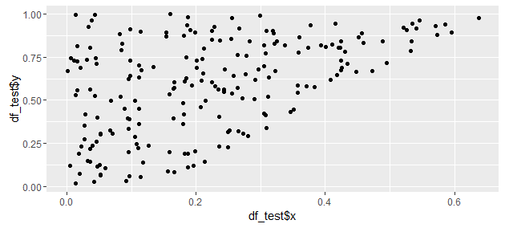

Previously, we considered nonlinear *regression* techniques. Next, we'll move to briefly covering nonlinear *classification* techniques, allowing us to improve upon logistic regression via more sophisticated and general methods. The theory of some of the classification techniques used in this assignment is discussed in *Notes on Classification Theory*; feel free to back to those notes as you work through the exercises below. The heavily theoretical discussion in those notes may become clearer as you gain some concrete intuition for how to apply these classification methods and how they work.

The field of nonlinear techniques is *very* vast and wide. As with the nonlinear regression assignment, you should be constantly referring to external sources to clarify details and improve your own understanding and intuition of the methods discussed. The lesson below is designed to *guide* you in the correct directions, and the goal is not to speedily finish the exercises but rather to use them as prompts for your curiosity and as sources of further directions of intellectual exploration.

A substantial part of this lesson will be devoted to *linear* methods, but we will culminate with a very powerful nonlinear classification technique. By following the historical development of these statistical and algorithmic ideas, we hope to provide sufficient *motivation* at each step such that the entire path, from discriminant analysis all the way to support vector machines with nonlinear kernels, will feel natural rather than arbitrary.

Getting started
===============

We will use a combination of simulated and real data to explore classification techniques in R.

First, we can write some utility functions to generate our simulated data. For simplicity, we will restrict attention to the 2-dimensional [unit square](https://en.wikipedia.org/wiki/Unit_square) ($x \in [0,1]$, $y \in [0,1]$).

* Write a function `lin_pair(m, b, label)` that takes in integers `m`, `b`, and `label` and returns two numerics `c(x, y)` satisfying the following criteria:

	* Both `x` and `y` should be between 0 and 1.

	* If `label` is set to 1, then `y` must be greater than `m*x + b`. Conversely, if `label` is set to -1, then `y` must be less than `m*x + b`.

You can think of the function `lin_pair(m, b, label)` as picking a point in the unit square *uniformly randomly* from the region falling above or below the line $y = mx + b$.

* Plot the points you get from running `lin_pair()` multiple times with `m=2` and `b=-0.3`. Verify that the resulting plot resembles the image below.



We can also extend the same methodology to generate data falling above or below a *quadratic* curve (which will be more difficult to classify).

* Write a function `quad_pair(a, b, c, label)` which does the same thing for the quadratic parabola $y = a(x - b)^2 + c$. Verify that it works as desired by plotting the results.

We will also use the [*Iris* flower data set](https://en.wikipedia.org/wiki/Iris_flower_data_set), which was introduced by the statistician [Ronald Fisher](https://en.wikipedia.org/wiki/Ronald_Fisher) expressly for the purpose of demonstrating the usage of linear discriminant analysis for classification of different *Iris* species (*Iris setosa*, *Iris virginica*, and *Iris versicolor*).

{width=50%}

The *Iris* dataset is a default variable in base R.

* Set `df_iris = iris` to copy the *Iris* dataset to a different variable. Call `?iris` and read the *Description* section of the documentation.

* There are 4 different numeric variables in the *Iris* dataset, yielding $\binom{4}{2} = 6$ different pairs of these variables. Plot each pair of variables on a scatterplot with the points colored according to their species. For example, the code for plotting sepal width against sepal length should look like this:

	```r
	ggplot(df_iris,
	  aes(Sepal.Length, Sepal.Width, color=Species))
	  + geom_point()
	```

	Which pairs of variables are easy to separate? Which pairs of variables are more difficult to separate?

Finally, we will look at a dataset containing the results of chemical analysis on wines grown in the same region of Italy but from 3 different [cultivars](https://en.wikipedia.org/wiki/Cultivar). The data are available in the `wine-cultivars` datasets folder and also online at the [UCI Machine Learning Repository](https://archive.ics.uci.edu/ml/datasets/Wine).

* Load the wine dataset in `wine.data` and read the documentation in `wine.names`.

* Use [`aggregate()`](https://stat.ethz.ch/R-manual/R-devel/library/stats/html/aggregate.html) to view the mean value of each predictor variable for each the three different wine cultivars. (You'll have to set `FUN=mean` and convert the vector of class labels to a *list* before passing it into the `by` parameter.)

Discriminant analysis
=====================

As an example of generative binary classifiers, we will first consider the field of discriminant analysis, comprising [linear discriminant analysis](https://en.wikipedia.org/wiki/Linear_discriminant_analysis) (LDA) and [quadratic discriminant analysis](https://en.wikipedia.org/wiki/Quadratic_classifier#Quadratic_discriminant_analysis) (QDA). Both of these methods assume *a priori* that the two classes are generated from multivariate normal distributions. QDA allows the two distributions to have different covariances and thereby attempts to separate a [*quadric*](https://en.wikipedia.org/wiki/Quadric) (high-dimensional quadratic) surface separating the two classes, whereas LDA makes the additional simplifying assumption of equal covariances and consequently attempts to constructs a *linear* separating hyperplane.

Simulated data analysis
-----------------------

We'll first look at how LDA and QDA perform on simulated data.

* Generate 200 data points, 100 of which fall above the line $y = 0.75x + 0.05$ and 100 of which fall below the line $y = 0.75x -0.1$, along with a vector of class labels (taking on the values 1 and -1). Use `qplot()` to plot a scatterplot of the data, passing in the class labels to the `color` parameter.

* Do the same with 100 data points falling above the parabola $y = 4(x - 0.5) + 0.4$ and 100 data points falling below the parabola $y = 4(x - 0.5) + 0.38$.

`partimat()` (from the `klaR` package) can be used to graph the decision boundary resulting from LDA or QDA. It accepts a *data frame* of predictors as its first argument, a *factor* of class labels as its second argument, and a `method` parameter which should be set to either `"lda"` or `"qda"`.

* Use `partimat()` to run both LDA and QDA on both datasets. Interpret the results.

Multiclass classification
-------------------------

The theoretical framework of LDA and QDA can easily be extended to *multiclass classification*, which we will briefly illustrate with the wine cultivars dataset. For this, we'll run LDA directly via `lda()` (in the `MASS` package).

* Use `lda()` to make a classification model for the three different wine cultivars in terms of the chemical properties of the sampled wines.

Multiclass LDA classifies points by producing *linear discriminant functions* and calculating the values of those discriminant functions at data points. Each discriminant function will classify a data point as "class $X$" or "not class $X" depending on the *sign* of the function at that point (whether the associated value is positive or negative). As such, for a dataset with $k$ classes, we calculate $k-1$ different discriminant functions.

* Use `predict()` on the result of `lda()` with no additional arguments. The result of `predict()` stores the values of the discriminant functions evaluated on the training data in the variable `$x`. For each of the two discriminant variables, pass in its values along with the true class labels to `ldahist()`. Interpret the results.

However, LDA also lends itself to a very nice *geometric* interpretation. It can be thought of as a generative dimensionality reduction technique where $p$ features are *projected* onto a $(k-1)$-dimensional space. Recall that LDA assumes that each class of the data is generated from a multivariate normal distribution---the projections are thus calculated such that in the reduced-dimensional space, the variance within each class is *minimized* while the distances between the means of the assumed distributions are *maximized*.

* Plot the values of the two discriminant functions against each other for the wine cultivars dataset, coloring the points according to their true classification. Compare this to a plot of the first two *principal components* of the wine cultivars dataset, again with the points colored according to their classification. Interpret the results.

Although LDA and QDA work well when the data approximately satisfy the assumptions which are made by the underlying generative models, they fail to work well in more complex situations where those assumptions are violated. For example, if the real distributions of the data are *very* non-Gaussian, both LDA and QDA will fail. In addition, even if the data *are* generated in a Gaussian fashion, LDA will perform very poorly if the distributions differ in their variances instead of in their means. The weaknesses of discriminant analysis methods lead us naturally toward the question: how strong can we make a classifier without invoking *any* generative assumptions?

* Briefly read [this StackExchange answer](http://stats.stackexchange.com/a/103552/115666) on visualizing the class boundaries of LDA applied to the *Iris* dataset.

Perceptrons
===========

We will move to consideration of purely *predictive* methods---algorithms which do not posit any underlying generative model and simply aim to separate two classes of data as well as possible. In particular, we will first look at the famous *perceptron algorithm*, one of the first and simplest purely predictive classification techniques developed. It was developed in 1957 at the [Cornell Aeronautical Laboratory](https://en.wikipedia.org/wiki/Cornell_Aeronautical_Laboratory) by [Frank Rosenblatt](https://en.wikipedia.org/wiki/Frank_Rosenblatt), who initially caused quite a stir in the media with his controversial statements about his hardware implementation of the perceptron; indeed, *The New York Times* reported the machine to be "the embryo of an electronic computer that [the Navy] expects will be able to walk, talk, see, write, reproduce itself and be conscious of its existence".

Regrettably, the perceptron method was not *that* powerful, but it performed well at standard classification tasks nevertheless. For labeled training data in $n$-dimensional space, the perceptron algorithm will attempt to construct an $(n-1)$-dimensional hyperplane which separates the two classes. Although the perceptron is a *linear* method, we present it here for two reasons: first, it is historically illuminating and enjoyable to code yourself; second, its *drawbacks* will provide us with the *motivation* behind the development of much more sophisticated, modern techniques.

.](perceptron.jpeg){height=70%}

Regarding the perceptron's advantages, Vapnik writes:

> By the time the Perceptron was introduced, classical discriminant analysis based on Gaussian distribution functions had been studied in great detail. [...]
> 
> [T]o construct this model using classical methods requires the estimation of about $0.5n^2$ parameters where $n$ is the dimensionality of the space. Roughly speaking, to estimate one parameter of the model  requires $C$ examples. Therefore to solve the ten-digit recognition problem using the classical technique one needs $\approx 10(400)^2C$ examples. The Perceptron used only 512.
> 
> This shocked theorists. It looked as if the classical statistical approach failed to overcome the curse of dimensionality in a situation where a heuristic method that minimized the empirical loss easily overcame this curse.

Here, we will explore the strengths of the perception in some simpler contexts.

Generating data
---------------

First, we will generate linearly separable data to use with a perceptron.

* Generate 1000 data points falling above the line $1.5x + 0.2$ and 1000 data points falling below the line $1.5x + 0.05$, binding them into the same matrix.

* Create a `labels` vector where the $i$th entry is 1 or -1 according to whether the $i$th data point in the matrix was generated with `label=1` or `label=-1`. Graph the results with `qplot()`, using the `color=labels` parameter to color the points.

* Add a column to your matrix of data consisting purely of 1s. The perceptron algorithm needs this to work properly; it serves as an "intercept term" that allows the separating hyperplane it generates to be shifted up or down instead of being necessarily centered at 0.

Implementing a perceptron
-------------------------

For each point $\textbf{x}_i$, the perceptron algorithm forms an augmented point $\textbf{x}_i' = (\textbf{x}, 1)$. The algorithm proceeds to work by updating a vector of *weights* $\textbf{w}$ step-by-step as it iterates over the augmented data points, adjusting the weights whenever it encounters a training point which it misclassifies. To perform classification, it looks at the *sign* of $\textbf{w} \cdot \textbf{x}_i'$, classfiying positive results as 1 and negative results as -1.

* Write a function `dot(x, y)` which computes the [dot product](https://en.wikipedia.org/wiki/Dot_product) between the vectors `x` and `y`, denoted as $x \cdot y$. It is equal to the sum of $x_1y_1 + x_2y_2 + \cdot + x_ny_n$.

* Write a function `perceptron(xs, y, w, rate, seed)` following these specifications:

	* Take as input a matrix of data `xs`, a vector of labels (1 or -1) `y`, a vector of weights `w`, a learning rate `rate`, and a random seed `seed`. Set the seed to `seed.

	* Iterate over the rows of `xs` in *random order*. For each row `xi`, do the following:  Compute the *dot product* between `xi` and `w`. The classification of `xi`, according to the perceptron, is the `sign()` of the dot product. If the classification is a false negative, update `w` by *adding* `rate*xi`, and if the classification is a false positive, update `w` by *subtracting* `rate*xi`.

	* Return the calculated weights after the iterations finish.

Congratulations: you have successfully implemented one of the classic algorithms of machine learning. It even counts as a neural network (with a single neuron)!

Visualizing your results
------------------------

The weights of the perceptron parametrize a *line* given by `w[1]*x + w[2]*y + w[3] = 0`. This is called the *decision boundary*. Intuitively, the vector `w`, if we ignore its last entry, is a vector which is *perpendicular* to the separating hyperplane.

* What are the slope and $y$-intercept of this line in terms of the components of `w`? (Recall that a slope of a line $y = mx + b$ is given by $m$ with the $y$-intercept at $(0, b)$.)

* Write a function `perceptron_plot(xs, y, w)` which uses `qplot()` to plot the data in `xs` colored according to the labels in `y` and adds on a `geom_abline(intercept=..., slope=...)` term to overlay the line parametrized by `w` on the scatterplot of data.

* Repeatedly run `perceptron()` on your generated data with `rate=1` and `seed=6` until the output weights converge. You should initialize the weights vector to `rep(0, 3)` and then pass in the output of the first `perceptron()` call as the initial weights of the next. After each individual to `perceptron()`, use `perceptron_plot()` to plot your intermedate results.

A perceptron is *guaranteed to converge* to a line which fully separates two class *if* the two classes are linearly separable. If a perceptron converges to a solution, that means that it will correctly classify *all* of the training data. As such, once a convergent solution for `w` is reached, further calls of `perceptron()` will leave `w` unchanged. In the following exercises, we will explore the convergence properties of the perceptron.

* Write a function `perceptron_conv()` which takes in the same arguments as `perceptron()` aside from `w`. It should run `perceptron()` repeatedly until the solution converges, returning a list with the final weights.

* Set the seed to 1 and plot the decision boundary which `perceptron_conv()` gives you for your output. Try setting the seed to integers from 2 to 10 as well and plot each result. How much variation do you observe? What if you only use a dataset of 20 points (generated in the same fashion) rather than a dataset of 2000?

* Write a function `perceptron_time(xs, y, rate)` which runs `perceptron_conv()` 10 times, with the random seed set to 1 through 100, and times each iteration with the [`tictoc`](https://cran.r-project.org/web/packages/tictoc/index.html) package. It should return the average time elapsed over the 100 iterations. Use `perceptron_time()` to explore how the average convergence time varies for both your large and small simulated datasets as you vary the `rate` parameter over the range `10^seq(-1, 2, length.out=20)`.

As you can see, the perceptron algorithm typically works pretty well. Unfortunately, despite its advantages, the standard perceptron cannot classify data which are *not* linearly separable---the algorithm will simply not converge.

* Verify that the perceptron algorithm does not converge on a dataset which is not linearly separable by using `quad_pair()` to create a dataset of two linearly nonseparable classes and passing it into `perceptron()` repeatedly. (Remember to add on the column of 1s.)

* Restrict the *Iris* dataset to the sepal length and sepal width variables. Plot the data and restrict to the two species which are *not* linearly separable from one another. What happens when you run `perceptron_conv()` to classify those two species? Plot the "solution" returned by the perceptron for some intuition.

If the data points are iterated over in the same order each time, the weights will eventually *cycle* in the case of nonseparability, but detecting a cycle can take a long time if the sample size is large. Also, as you have seen, when it *does* converge, the perceptron's solution is highly dependent upon choice of random seed. When the training data are linearly separable *and* there exists a "gap" or "margin" between them, there are infinitely many possible choices of a valid decision boundary. We will soon see how to resolve these problems.

* Read more about the fascinating history of perceptrons in the Wikipedia article for Minsky and Papert's book titled [Perceptrons: an introduction to computational geometry](https://en.wikipedia.org/wiki/Perceptrons_(book)).

Support vector machines
=======================

Support vector machines are implemented in R as `svm()` in the `e1071` package. When you call `svm()` in the following exercises, you should always specify `kernel="linear"`, because `svm()` defaults to using a *radial* kernel. (We will discuss kernel methods later.)

* Return to the linearly separable data with 2000 points which you initially used for the perceptron. Remove the column of 1s, convert the matrix into a data frame, add on a column with the class labels (which should be $\pm 1$), and convert the class label column into a factor.

* Run `svm()` on your data to predict class label from $x$ and $y$ coordinates. Visualize the resulting model with `plot(fit, df)`. The points marked with an "X" are the support vectors of the corresponding maximum-margin hyperplane.

* Vary the `cost` parameter of `svm()` from 0.1 all the way to much higher values. Each time, plot the resulting SVM fit. Interpret the results.

* Generate 40 data points, where 20 of them fall above $y = 3(x - 0.5)^2 + 0.55$ and the other 20 fall below $y = 3(x - 0.5)^2 + 0.4$. Plot the data. (If you want a better visualization of what the class boundaries are like, plot the result with 2000 points.) Turn your matrix of data into a data frame and add a column with class labels; turn the class label column into a factor.

* Try classifying the data with a linear SVM. How well does it work? How does the hyperplane change as you vary $C$?

* How well can a linear SVM separate data when each class is drawn from a different multivariate normal distribution? Try it for both distributions which have means close to each other and distributions with have means far away from each other.

Having used SVMs to classify some data, it may not yet be entirely clear why support vector machines receive so much attention. Is the support vector machine not simply a slightly better version of the perceptron? Is it not also almost entirely reliant upon the data being approximately linearly separable? In the next section, you will see how we can cleverly overcome these challenges.

* Our current formulation of support vector machines only supports binary classification. How would you use a SVM for multiclass classification? Come up with at least one plausible method.

Nonlinear kernels for SVMs
--------------------------

The `svm()` function supports `"radial"`, `"polynomial"`, and `"sigmoid"` as arguments for its `kernel` parameter. The documentation describes how to set the hyperparameters corresponding to each type of kernel.

* Try using a radial kernel SVM with different costs and values for $\sigma$ on both the linearly separable and the quadratically separable data, plotting the results of each fit. How does the best value of $\sigma$ vary with the sample size?

* Are there sample sizes for which a linear kernel can do better than a radial kernel?

* Write better versions of `lin_pair()` and `quad_pair()` that return points in $p$-dimensional space for a specified value of $p$. (You will need to pass in parameters which define a $(p-1)$ dimensional hyperplane or quadric surface and then check which side of the surface a generated point is on.) When $p$ is much greater than the number of data points, how does the performance of a linear kernel compare to the performance of a radial kernel?

* Just for fun, try to use the polynomial and sigmoid kernels to classify the data and see how well they do.

Closing notes
=============

The above discussion of classification techniques is by no means exhaustive! Its focus is on tracing the outlines of a multi-decade historical path of research and development, not on enumerating every nonlinear classification technique in modern use. We have omitted a variety of methods: some because they are derivatives of previously discussed algorithms, others because you have already had substantial practice applying them, and yet more because they would have been far too tangential to this lesson as a whole.

We developed $k$-Nearest Neighbors in the context of nonlinear regression, but $k$-NN can also be used for classification tasks. It works in precisely the way one would expect it to work: for any given point to classify, the algorithm looks at the nearest $k$ points in the training set and finds the most common class among those $k$ points. That class is the prediction result.

Although $k$-NN works well when there is enough data to capture, at a very fine-grained level, all of the detailed structure in the data, prediction is slow (because it depends on searching through the *entire* training set for every single prediction) and $k$-NN has difficulty with higher-dimensional data (because distance metrics stop working well at very high dimensions).

Moreover, since decision trees can also be used for classification (hence the acronym CART), random forests and gradient boosted trees can consequently also be used for classification tasks. Like with nonlinear regression, they typically function reasonably well. Note that the metric of variable importance is typically the *Gini impurity* for classification rather than the variance-based *impurity* calculated for regression tasks.

Finally, we have omitted any discussion of logistic regression and deep learning; the former has already been covered in substantial depth and the latter is too complex of a topic to be treated alongside other methods.

Choosing a classifier
---------------------

Like with nonlinear methods, one has the question of *which* classifier technique to apply to any given problem. Caruana and Niculescu-Mizil (2008), [An Empirical Comparison of Supervised Learning Algorithms](http://www.niculescu-mizil.org/papers/comparison.tr.pdf), Caruana *et al.* (2008), [An Empirical Evaluation of Supervised Learning in High Dimensions](http://cms.brookes.ac.uk/research/visiongroup/talks/rg_august_09_normalized_cuts/eval_of_supervised_learning_in_high_dimensions.pdf), and Fernández-Delgado (2014), [Do we Need Hundreds of Classifiers to Solve Real World Classification Problems?](http://jmlr.org/papers/volume15/delgado14a/delgado14a.pdf) all compare the performance of different classifiers. The paper by Fernández-Delgado is particularly informative, being a comparison of 179 different classifiers from 17 families on the UCI Machine Learning Repository's classification datasets. There is also a [follow-up](http://fastml.com/what-is-better-gradient-boosted-trees-or-random-forest/) from the authors about the performance of gradient boosted trees (omitted in the original study).

The takeaway broadly seems to be: if nonlinear classification is necessary, try using random forests, gradient boosted trees, or support vector machines with nonlinear kernels. Decision tree ensemble methods will function well in general, although specific tasks may be particularly well-suited for a SVM with a specialized kernel.

Closing notes
=============

TODO