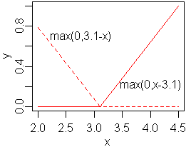
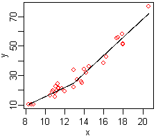
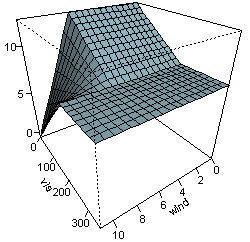
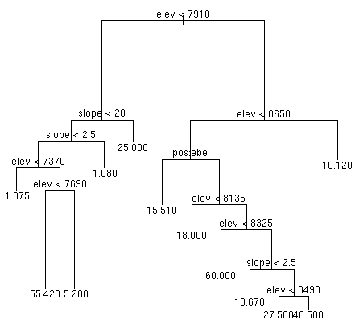

In this lesson, we will explore a collection of standard nonlinear regression techniques through predicting wine quality in terms of chemical properties. At the end, we'll combine all of these methods with [stacking](https://en.wikipedia.org/wiki/Ensemble_learning#Stacking) to create a model which performs better than any individual technique alone.

Nonlinear regression is a tremendously large topic---large enough that no single authoritative document should serve as your only source of knowledge. As you work through this assignment, you should seek to clarify for your own understanding the details of each method used below. You should be consistently referring to *Applied Predictive Modeling* and *Introduction to Statistical Learning* as well as Internet resources to gain visual intuition for how nonlinear regression techniques work and a more sophisticated theoretical understanding of the underlying mathematics. This assignment is designed to *guide* you in the right directions, but it is *not* a replacement for individual curiosity. The goal is not to complete every problem below as rapidly as possible but rather to use them to generate directions of further inquiry.

Getting started
===============

First, we'll load and visualize the data with which we'll be working.

The wine quality dataset can be found in the `wine-quality` dataset folder (with documentation in `winequality.names.txt`) or downloaded on the [UCI Datasets page](http://archive.ics.uci.edu/ml/datasets/Wine+Quality). The white wine dataset is three times the size of the red wine dataset, so we'll be focusing on the former -- with more data and consequently a greater "resolution", the advantages of nonlinear techniques become more apparent.

* Load the white wine dataset from `winequality-white.csv`. Read the associated documentation. Replace each space in the column names with an underscore (`"_"`).

* Use `qplot(...) + geom_smooth()` to plot wine quality against each of the individual variables representing chemical properties in the white wine dataset. Which variables are strongly *and* nonlinearly associated with wine quality?

Elastic net regularization
==========================

Before using nonlinear methods to predict white wine quality, we will use elastic net regularized linear regression to calculate a performance "baseline" to which we can compare the performance of nonlinear methods.

First, we'll write a utility function for easily accessing `caret`'s `train()`, which will serve as a standardized interface for applying a variety of different nonlinear techniques. `caret` supports [a very large number of different models](https://topepo.github.io/caret/modelList.html)!

* Load the following function into R:

	```r
	caret_reg = function(x, y, method, grid, ...) {
	  set.seed(1)
	  control = trainControl(method="repeatedcv", repeats=1,
	                         number=3, verboseIter=TRUE)
	  train(x=x, y=y, method=method, tuneGrid=grid,
	        trControl=control, metric="RMSE",
	        preProcess=c("center", "scale"), ...)
	}
	```

	The `...` parameter passes any extra parameters of `caret_reg()` directly into the call to `train()`, allowing us to pass in additional parameters to whatever modeling method we're using. Ensure that you understand how the above code works.

* Use [`expand.grid()`](https://stat.ethz.ch/R-manual/R-devel/library/base/html/expand.grid.html) to create a grid of hyperparameters to search over with `alpha=seq(0, 1, 0.1)` and `lambda=2^seq(-4, 1, length.out=20)`.

* Use `caret_reg()` with `method="glmnet"` to fit an elastic net regularized linear model for wine quality. Create a data frame `results` with two columns, `method` and `min_rmse`, and add in a row with values corresponding to the model you just fit.

As you work through this assignment, continually update `results` with a new row for the best run of each method you try.

$K$-Nearest Neighbors
===================

$K$-Nearest Neighbors (KNN) is one of the simplest possible nonlinear regression techniques.

First, we pick a value of $k$. Next, suppose that we have a dataset of $n$ points, where each $\textbf{x}_i$ is associated with a target variable taking on value $y_i$. Finally, suppose that we have a new point $\textbf{x}^\star$ and we want to predict the associated value of the target variable. To do so, we find the $k$ points $\textbf{x}_i$ which are closest to $\textbf{x}^\star$, look at the associated values of $y_i$, and take their average.

The only hyperparameter to tune is $k$. A larger value of $k$ helps guard against overfitting but will make the model less sensitive to fine-grained structure in the data.[^prior]

[^prior]: One way to interpret $k$-NN is that it's equivalent to the imposition of a Bayesian prior saying that your dataset is sufficiently fine-grained enough that the value of the target variable at any given point is completely determined by the value of the target variable at nearby points. Given enough granularity, this is in some sense guaranteed to be true (assuming your target variable is a reasonably smooth function of the feature space), but often it's not *perfectly* true. Later on, we'll be looking at support vector machines with a Gaussian basis / radial kernel function, which can be interpreted as a sort of "regularized $k$-nearest neighbors model" and performs very well in practice for classification.

* Evaluate the performance of $k$-Nearest Neighbors on the wine quality dataset by setting `method="knn` and searching over values of $k$ from 1 to 20.

Multivariate adaptive regression splines
========================================

Multivariate adaptive regression splines (MARS) is an extension of linear models which uses *hinge functions*.[^spline] MARS models a target variable as being a linear combination of functions of the form $\max(0, \pm (x_i-c))$, where $x_i$ is one of the predictor variables.

[^spline]: The word "spline" has historical origins in mechanical engineering and construction. Originally, it meant a piece of thin wood or a metal slat, but by the 20th century came to mean a flexible ruler used to interpolate (*i.e.*, fill in the missing points of) curves when "blowing up" a smaller diagram into a full-size diagram. The ruler would be held at various important fixed points, and the natural minimum-strain-energy configuration assumed by the ruler between those points would be taken as the interpolated curve. The first usage of "spline" in mathematics is typically accepted to be Schoenberg (1946), "Contributions to the Problem of Approximation of Equidistant Data by Analytic Functions".

	MARS models themselves were introduced only in 1991 by Jerome H. Friedman.

{width=40%}

Combining hinge functions allows us to model nonlinear relationships in the data, like so:

{width=40%}

By increasing the *degree* of a MARS model, one can allow for *products* of multiple hinge functions (*e.g.*, $\max(0, x_1 - 10) \times \max(0, 2 - x_3)$), which models interactions between the predictor variables.

{width=40%}

Intuitively, one can think of a 1st MARS model with $p$ predictor variables as being a piecewise linear combination of hyperplanes: with 1 predictor variable our resulting model looks like various straight lines connected together, with 2 predictors our resulting model looks like various planes pasted together, and so on and so forth. Raising the degree then allows for polynomial-like nonlinear *curvature*, so instead of connecting together linear functions in a piecewise manner we connect together quadratics, cubics, etc.

MARS models have two hyperparameters: `degree`, the degree of the model, and `nprune`, the maximum number of additive terms allowed in the final model. The 
latter controls the maximum complexity of the model.

* Evaluate the performance of MARS on the wine quality dataset by setting `method="earth"` and searching over `degree=1:5` and `nprune=10:30`.[^earth]

[^earth]: Why "earth"? [Wikipedia says:](https://en.wikipedia.org/wiki/Multivariate_adaptive_regression_splines) "The term 'MARS' is trademarked and licensed to Salford Systems. In order to avoid trademark infringements, many open source implementations of MARS are called 'Earth'."

`caret` fits a model at the end with the whole dataset and the best hyperparameters, storing the model in `$finalModel`. Use `summary()` to view the model and interpret the results. (Note that `h(...)` represents a term of the form $\max(0, \ldots)$.)

The advantage of MARS models is that they are easy to fit and interpret, especially 1st degree MARS models.

Decision tree methods
=====================

The previous two nonlinear algorithms we have seen are not particularly impressive, outperforming elastic net regularized linear regression only by a relatively small margin. However, we'll move into a discussion of *decision trees*. By themselves, decision trees are *also* not particularly good and tend to overfit badly, but they can be *combined* into various different regression algorithms which *do* perform quite well.

Standard regression trees
-------------------------

Regression trees are easiest to understand visually:

{width=60%}

Predictions are made on new data by following the tree down from the top to one of the terminal nodes and then taking the average of the values of all the training points which are located at that node. At each split, the [recursive partitioning](https://en.wikipedia.org/wiki/Recursive_partitioning) algorithm tries to find the variable which, if used for that split, would improve the algorithm's predictions the most. The algorithm stops growing the tree when no split would improve the prediction quality above a predefined limit.

The *complexity parameter*, usually denoted `cp`, is the single hyperparameter used for fitting regression tree models. It is the "predefined limit" mentioned above and is expressed in units of *Gini impurity*, a metric of variable importance.

* Evaluate the performance of regression trees on the wine quality dataset by setting `method="rpart"` and searching over `cp=10^seq(-3, 0, length.out=10)`.

* View the final model by directly printing it in the console. (Unlike with MARS, the result of `summary()` is *less* interpretable than just printing the fit object directly.) Interpret the results.


* View the documentation in `?rpart.object` to determine how to access the Gini impurity (variable importance) for the final regression tree model. Compare the order of the splits in the tree with the size of the Gini impurity for each variable.

You will often see regression trees called "CART", which stands for "Classification And Regression Tree". As the name indicates, decision trees (and methods derived from decision trees) can also be used for classification. We'll focus on their application to regression in the present assignment; once you understand how they work for regression, it is straightforward to apply them to classification tasks.

Random forests
--------------

In short, a *random forest* trains many different different regression trees and averages their predictions together, with these two conditions on the regression trees:

1. Each regression tree is trained on a bootstrapped sample of the original dataset.[^bagging] This technique is known as *bagging* and helps combat overfitting.

2. At each split of each regression tree, only a random subset of the original predictors are considered as candidate variables for the split. This prevents very strong predictors from dominating certain splits, *decorrelating* the regression trees from each other.

[^bagging]: Recall that a bootstrapped sample of a dataset is a dataset of the same size formed by repeatedly sampling the original dataset *with replacement*.

The size of the random subset of predictors considered at each split is the single hyperparameter involved in fitting a random forest model, typically denoted `mtry`. For a dataset with $p$ predictors, it is typically advised to try setting `mtry` to $\mathrm{floor}(\sqrt{p})$, $\mathrm{floor}(p/3)$, and $p$, with further refinement of the search space afterward if desired.[^mtry]

[^mtry]: Setting the value of `mtry` carefully is of [debatable importance](http://code.env.duke.edu/projects/mget/export/HEAD/MGET/Trunk/PythonPackage/dist/TracOnlineDocumentation/Documentation/ArcGISReference/RandomForestModel.FitToArcGISTable.html). Cutler *et al.* (2007), [Random Forests for Classification in Ecology](http://depts.washington.edu/landecol/PDFS/RF.pdf) reports that performance isn't very sensitive to `mtry`, whereas Strobl *et al.* (2008), [Conditional variable importance for random forests](http://bmcbioinformatics.biomedcentral.com/articles/10.1186/1471-2105-9-307) reports the opposite. Finally, by Genuer *et al.* (2008), [Random Forests: some metholodological insights](http://www.math.u-psud.fr/~genuer/genuer-poggi-tuleau.rf-insights.pdf) finds varying importance for `mtry` depending on properties of the dataset. *All considered*, I think it's fine to initially just try $p/3$, $\sqrt{p}$, and $p$, and to decide if further tuning is warranted based on those results.

* Evaluate the performance of random forests on the wine quality dataset by setting `method="ranger"` and searching over `mtry=2:6`.[^parrf] In the call to `caret_reg()`, pass in the parameter `importance="impurity"`.

[^parrf]: The `ranger` method is a faster *and* parallelized implementation of the random forests algorithm. One can set `method="rf"` for the standard (and slower) version.

The random forest algorithm calculates the [Gini impurity](https://en.wikipedia.org/wiki/Decision_tree_learning#Gini_impurity) for each of the predictor variables. Although the Gini impurity is typically  calculated with respect to *individual* regression trees, the impurity for each variable can be averaged over the entire random forest for an ensemble-wide measure of variable importance.

* Read the documentation for `ranger()` to determine how to access the calculated Gini impurity for the final random forest model. Compare the Gini impurities with the variable splits calculated in the ordinary regression tree model.

Ordinary regression trees are easily interpretable from visual inspection of the splitting structure of the tree. Examining the Gini impurity is therefore substantially more useful for random forest models, where it would be an absurdly onerous task to individually inspect each constituent regression tree of the final random forest model.

Finally, we can fit each data point in the training data with the trees which were *not* trained on that data point to obtain an *out-of-bag error*, which is a good estimate for the generalizable error of our model.

* Read the documentation for `ranger()` to determine how to access the calculated out-of-bag error. Compare it with the RMSE calculated by `train()`.[^won]

[^won]: If you're wondering why the former is much smaller than the latter: re-read the documentation, paying special attention to what error metric is actually being used.

We could have selected the optimal value of `mtry` with the out-of-bag error instead of using cross-validation, which would have saved a considerable amount of computation time. (However, we can't use such a method for other nonlinear regression methods, so we wouldn't have been able to do an apples-to-apples comparison of random forests against other techniques.)

Random forests are easy to parallelize because each of the constituent trees of a random forest can be trained independently of the others. This also means that a random forest model can be subsequently *improved* by training and adding on more regression trees if the performance of the model is unsatisfactory. The ease with which random forest models are applied makes them a standard first choice of nonlinear regression method to *e.g.* test if nonlinear methods can offer any substantive improvement over linear models at all for a given dataset under consideration. For such a purpose, the computation time required for testing high values of `mtry` can be quite significant if the dataset is large, but $\mathrm{floor}(\sqrt{p})$ typically works well for obtaining an approximate baseline level of performance.

Gradient boosted trees
----------------------

Boosting is a technique which iteratively improves an *ensemble* of decision trees.[^ada] Specifically, *gradient boosting* is a very powerful nonlinear technique and is one of the best "off-the-shelf" machine learning models.[^kuhn] A *gradient boosted tree* model trains relatively quickly, can pick up on fairly complicated nonlinear interactions, does not typically suffer from much overfitting, and generally performs better than a random forest. However, they are more difficult to use than random forests because of the substantially larger number of hyperparameters to tune, necessitating a much greater overall time spent training a well-performing model.[^hyp]

[^ada]: The first implementation of boosting, or at least the most famous one, is [AdaBoost](https://en.wikipedia.org/wiki/AdaBoost), which can be considered to be a [special case of gradient boosting](http://stats.stackexchange.com/a/164262/115666).

[^kuhn]: See Ben Kuhn's [comments](http://www.benkuhn.net/gbm) on gradient boosting.

[^hyp]: See [StackExchange](http://stats.stackexchange.com/questions/25748/what-are-some-useful-guidelines-for-gbm-parameters) for a brief overview of tuning `gbm()` hyperparameters.

Intuitively, one can think of boosting as a method which iteratively improves a collection of many different regression trees by repeatedly training new regression trees on the *residuals* of the predictions made by the current ensemble and incorporating the resulting tree into the overall ensemble.

* Read the documentation for `gbm()` (in the `gbm` package) to figure out what the `n.trees`, `shrinkage`, `interaction.depth`, and `n.minobsinnode` hyperparameters do.

* Evaluate the performance of gradient boosted trees on the wine quality dataset by setting `method="gbm"` and searching over `n.trees=500`, `shrinkage=seq(0.01, 0.1, 0.03)`, `interaction.depth=c(1, 5, 10, 20, 40, 60)`, and `n.minobsinnode=1:3`. Note that you'll have to pass in the features as a *matrix* rather than a data frame (because of an annoying peculiarity in how `gbm()` works).

* With the optimal values of the hyperparameters determined in the previous call to `caret_reg()`, run `caret_reg()` again and tune only the value of `n.tree`, trying values from 500 to 5000 in steps of 5000.

Your gradient boosted tree model here may not actually perform as well as your random forest model. A more fine-grained hyperparameter search would likely change that, but at the cost of quite a large amount of computation time. If you would like to try it nevertheless, do so after completing the remainder of this assignment.

Although the sequential dependence of this method means that the algorithm cannot be parallelized at the level of individual trees, the computation of each regression tree can itself be parallelized. Such a method is used in the [`xgboost`](https://cran.r-project.org/web/packages/xgboost/) package.

Cubist
------

Cubist is a nonlinear, decision tree-based regression algorithm developed by [John Ross Quinlan](https://en.wikipedia.org/wiki/Ross_Quinlan) with a [proprietary parallelized implementation](https://www.rulequest.com/cubist-info.html). (The single-threaded code is open source and has been [ported to R](https://cran.r-project.org/web/packages/Cubist/vignettes/cubist.pdf.)

In practice, Cubist performs approximately as well as a gradient boosted tree (as far as predictive power is concerned).[^subpixel] Having only two hyperparameters to tune, Cubist is a little simpler to use, and the hyperparameters themselves are very easily interpretable. However, the exact functionality of the algorithm is somewhat opaque due to its formerly proprietary nature, so Cubist receives relatively little attention and analysis relative to other methods.

[^subpixel]: In [Subpixel Urban Land Cover Estimation](http://www.nrs.fs.fed.us/pubs/jrnl/2008/nrs_2008_walton_003.pdf) by Walton (2008), various nonlinear regression methods are compared for a prediction task and Cubist is found to be superior to gradient boosted trees. A [comment on a Ben Kuhn post](http://www.benkuhn.net/gbm#comment-1175) reports the same result.

Broadly speaking, Cubist works by creating a *tree of linear models*, where the final linear models are *smoothed* by the intermediate models earlier in the tree. (It's usually referred to as a *rule-based model*.) Cubist incorporates a *boosting-like scheme* of iterative model improvement where the residuals of the ensemble model are taken into account when training a new tree. (It calls its trees *committees*.) In addition, Cubist can also adjust its final predictions using a more complex version of $k$-NN. When Cubist is finished building a rule-based model, Cubist can make predictions on the training set; subsequently, when trying to make a prediction for a new point, it can incorporate the predictions of the $K$ nearest points in the training set into the new prediction.

As such, there are two hyperparameters to tune, called `committees` and `neighbors`. `committees` is the number of boosting iterations (*i.e.*, the number of different trees to train), and the functionality of `neighbors` is easily intuitively understandable as a more complex version of $k$-NN.

* Evaluate the performance of Cubist on the wine quality dataset by setting `method="cubist"` and searching over `committees=seq(30, 50, 5)` and `neighbors=5:9`.

Stacking
========

[Stacking](https://en.wikipedia.org/wiki/Ensemble_learning#Stacking) is a technique in which multiple different learning algorithms are trained and then *combined* together into an *ensemble of models*.[^stack] The final 'stack' is very computationally expensive to compute but performs better than any of the individual models used in its creation.

[^stack]: The canonical paper on stacking is Wolpert (1992), [Stacked Generalization](http://machine-learning.martinsewell.com/ensembles/stacking/Wolpert1992.pdf).

Ensemble stacking using a `caret`-based interface is implemented in the [`caretEnsemble` package](https://cran.r-project.org/web/packages/caretEnsemble/index.html). We'll start off by illustrating how to combine (1) elastic net regularization, (2) MARS, and (3) standard regression trees.

We'll first have to specify which methods we're using and the control parameters:

```r
ensemble_methods = c('glmnet', 'earth', 'rpart')
ensemble_control = trainControl(method="repeatedcv", repeats=1,
                                number=3, verboseIter=TRUE,
                                savePredictions="final")
```

Next, we have to specify the tuning parameters for all three methods (suppose in the following that `grid_glmnet`, `grid_mars`, and `grid_rpart` are the hyperparameter grids for their associated methods):

```r
ensemble_tunes = list(
  glmnet=caretModelSpec(method='glmnet', tuneGrid=grid_glmnet),
  earth=caretModelSpec(method='earth', tuneGrid=grid_mars),
  rpart=caretModelSpec(method='rpart', tuneGrid=grid_rpart)
)
```

We then create a list of `train()` fits using the `caretList()` function (suppose in the following that `wine_features` is a data frame of features and `wine_quality` is the wine quality target variable):

```r
ensemble_fits = caretList(wine_features, wine_quality,
                          trControl=ensemble_control,
                          methodList=ensemble_methods,
                          tuneList=ensemble_tunes,
                          preProcess=c("center", "scale"))
```

Finally, we can find the best *linear combination* of our many models by calling `caretEnsemble()` on our list of models:

```r
fit_ensemble = caretEnsemble(ensemble_fits)
print(fit_ensemble)
summary(fit_ensemble)
```

By combining three simple methods, we've managed to get a cross-validated RMSE lower than the RMSE for any of the three individual models!

* How much lower does the RMSE get if you add in a $k$-Nearest Neighbors model to the stacked ensemble? What about a random forest or a gradient boosted tree?

In the [`caretEnsemble` documentation](https://cran.r-project.org/web/packages/caretEnsemble/vignettes/caretEnsemble-intro.html), read about how to use `caretStack()` to make a more sophisticated *nonlinear ensemble* from `ensemble_fits`.

* If you use a gradient boosted tree for `caretStack()`, is it any better than the simple linear combination?

* If you use all of the techniques you've just learned about in a large stacked ensemble, how low can you get the RMSE? (This might take a lot of computation time, so it's *optional*, but it's also fun.)

Closing notes
=============

By now, you've tried a fairly wide variety of nonlinear fitting techniques and gotten some sense for how each of them works.

When trying to do predictive regression modeling, it's usually advised to start out with random forests because they're easily tuned and perform decently without the need for a very detailed hyperparameter search.[^comp] Afterward, people will move to more sophisticated techniques such as gradient boosted trees. We have neglected two major classes of regression techniques: neural nets and support vector regression. They are very substantial topics in and of themselves, so they will be covered in future lessons.

[^comp]: One of the only good comparison of nonlinear regression techniques is in Chipman *et al.* (2010), [BART: Bayesian Additive Regression Trees](https://arxiv.org/pdf/0806.3286.pdf), which gives the following ordering (from better to worse): BART, 1-layer neural nets, gradient boosted trees, random forests. Cubist isn't used very much, mostly because almost nobody really knows what it does, even if its results are pretty good in practice. See also Santibanez *et al.* (2015), [Performance Analysis of Some Machine Learning Algorithms for Regression Under Varying Spatial Autocorrelation](https://agile-online.org/Conference_Paper/cds/agile_2015/shortpapers/100/100_Paper_in_PDF.pdf).

You may have noticed that tuning hyperparameters is a very important part of making nonlinear methods work well! As the techniques become more complex, the number of hyperparameters to tune can grow significantly. Grid search ordinarily works well, but in very complicated situations (10-20+ hyperparameters) it's better to use [*random* search](http://www.jmlr.org/papers/volume13/bergstra12a/bergstra12a.pdf); otherwise, there would just be far too many hyperparameter combinations to evaluate![^comb]

[^comb]: If you have, say, 15 hyperparameters, even the simplest possible grid search that selects one of two possible values for each hyperparameter still has $2^{15}$ configurations to iterate over. That will almost assuredly take far too long.

The `caret` package's documentation on [random hyperparameter search](http://topepo.github.io/caret/random.html) has this to say:

> The default method for optimizing tuning parameters in `train()` is to use a grid search. This approach is usually effective but, in cases when there are many tuning parameters, it can be inefficient. An alternative is to use a combination of [grid search and racing](http://topepo.github.io/caret/adaptive.html). Another is to use a random selection of tuning parameter combinations to cover the parameter space to a lesser extent.
> 
> There are a number of models where this can be beneficial in finding reasonable values of the tuning parameters in a relatively short time. However, there are some models where the efficiency in a small search field can cancel out other optimizations. For example, a number of models in `caret` utilize the "sub-model trick" where [even when] $M$ tuning parameter combinations are evaluated, potentially far fewer than $M$ [complete] model fits are required. This approach is best leveraged when a simple grid search is used. For this reason, it may be inefficient to use random search for [models including gradient boosted trees, random forests, etc.]

Indeed, the `caret` package is very well-designed; on account of its many internal optimizations, grid search will typically suffice for your purposes. Nevertheless, it's good to be aware that alternatives to grid search exist.