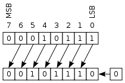

We'll conclude with a selection of exercises about common algorithms. The material below is likely to show up on programming-focused interviews!

Run-length encoding
===================

[Run-length encoding](https://en.wikipedia.org/wiki/Run-length_encoding) is a simple form of data compression which represents data as a series of *runs* (sequences that consist of the same character repeated multiple times). It was originally used in the transmission of television signals and was used as an early form of image compression on [CompuServe](https://en.wikipedia.org/wiki/CompuServe) before the development of [GIF](https://en.wikipedia.org/wiki/GIF). Indeed, the modern [JPEG](https://en.wikipedia.org/wiki/JPEG) image compression algorithm incorporates run-length encoding into its functionality.

* Write a function `arg_max(v)` which takes in a numeric vector `v` and returns the *position* of its greatest element. If its greatest element occurs in multiple places, print out the position of its first occurrence. You may find [`max()`](https://stat.ethz.ch/R-manual/R-devel/library/base/html/Extremes.html) and [`match()`](https://stat.ethz.ch/R-manual/R-devel/library/base/html/match.html) helpful.

* Write a function `longest_run(v)` that prints out the longest "run" (sequence of consecutive identical values) in `v`. If there are multiple runs of the same length which quality, print out the first one. You may find [`rle()`](https://stat.ethz.ch/R-manual/R-devel/library/base/html/rle.html) helpful. The function evaluated on `v = c(1, 2, 3, 3, 2)` should return `c(3, 3)`.

Reservoir sampling
==================

A classic task in data analysis is the problem of reading in $n$ data items one by one for a very large and *unknown* $n$ and choosing a random sample of $k$ items. This can be done with [reservoir sampling](https://en.wikipedia.org/wiki/Reservoir_sampling), introduced in 1985 by [Jeffrey Vitter](https://en.wikipedia.org/wiki/Jeffrey_Vitter) as "Algorithm R".

The algorithm consists of the following:

1. Initialize a "reservoir" of size $k$ populated with the first $k$ data items.
2. Continue reading in the data items. For the $i$th data element, generate a random integer $j$ between 1 and $i$ inclusive. If $j \le k$, then the $j$th item in the reservoir is replaced with the $i$th data item.

Now, following the above description:

* Write a function `reservoir(v, k)` which iterates over the elements of `v` a *single time* and randomly chooses $k$ of them with reservoir sampling. (For the random integer generation, combine [`floor()`](https://stat.ethz.ch/R-manual/R-devel/library/base/html/Round.html) with [`runif()`](http://www.inside-r.org/r-doc/stats/runif).)

* Run `reservoir()` repeatedly, choosing 5 elements randomly from a vector of 20 elements. For each item, calculate the probability of it being chosen for the sample.

Permutation generation
======================

Given a finite set of items in a given order, a [permutation](https://en.wikipedia.org/wiki/Permutation) of those items is a distinct reordering of them. For example, a permutation of $\{A, B, C\}$ is $\{B, A, C\}$. The generation of permutations is yet another classic algorithms problem.

Suppose we wish to generate all permutations of the integers from 1 to $n$. The easiest way to do so is as follows: Begin with the set of all permutations of the integers from 1 to $n-1$. For each of those permutations, insert $n$ in every possible position to form a permutation of the integers from 1 to $n$. Discard the repeats. To get the permutations of 1 to $n-1$, use the permutations of 1 to $n-2$; for those, use the permutations of 1 to $n-3$, and so on and so forth ...

* Following the above strategy, write a function `perm_naive(n)` to return a list of all permutations of the integers from 1 to $n$. You may find [`unique()`](https://stat.ethz.ch/R-manual/R-devel/library/base/html/unique.html) helpful. Test your function on small values of $n$ like 2, 4, and 6.

The above method is very slow, but there are much faster algorithms. Indeed, it is not even necessary to generate the permutations of 1 to $n-1$ in order to generate all permutations of 1 to $n$.

* We can generate permutations in [lexicographic order](https://en.wikipedia.org/wiki/Lexicographical_order). Follow the [Wikipedia description of the algorithm](https://en.wikipedia.org/wiki/Permutation#Generation_in_lexicographic_order) to write a function `perm_lexico(n)` which returns a list of all the permutations of 1 to $n$ in lexicographic order.

Quicksort and quickselect
=========================

One of the most straightforward sorting algorithms is [*quicksort*](https://en.wikipedia.org/wiki/Quicksort), which sorts a list of length $n$ in $O(n \log n)$ time. It was developed by [Tony Hoare](https://en.wikipedia.org/wiki/Tony_Hoare) at Moscow State University as part of a translation project for the [National Physical Laboratory](https://en.wikipedia.org/wiki/National_Physical_Laboratory,_UK) requiring the alphabetical sorting of Russian words.

The steps of a simplified[^simp] form of the algorithm are as follows:

[^simp]: The presented algorithm does not operate *in place*.

1. For a vector `L`, pick a random position `i`. The element `L[i]` is called the *pivot*. (If the pivot is the only element, return it.)
2. Form two vectors of elements `lesser` and `greater` which hold elements of `L` at positions *other than* `i` which are respectively lesser than or greater than `L[i]`. (Elements equal to `L[i]` can go in either one.)
3. Call the algorithm thus far `qs()`. Our result is the combination of concatenating together `qs(lesser)`, `L[i]`, and `qs(upper)`.

Now it's your turn:

* Implement a `quicksort(L)` function that sorts a vector of numbers `L` from least to greatest. Verify that your function works by writing a loop which generates 100 vectors of 10 random integers and compares the output of `quicksort()` to the built-in [`sort()`](https://stat.ethz.ch/R-manual/R-devel/library/base/html/sort.html). Compare the performance of `quicksort()` to that of [`sort()`](https://stat.ethz.ch/R-manual/R-devel/library/base/html/sort.html).

The [*quickselect*](https://en.wikipedia.org/wiki/Quickselect) algorithm, which is similar to quicksort, allows you to find the $k$th largest (or smallest) element of a list of $n$ elements in $O(n)$ time. The difference in the algorithms is that in each iteration, we only have to recurse into *one* of the two subdivisions of the vector, because we can tell which one holds our desired value based on the value of $k$ and the sizes of `lesser` and `greater`.

* Implement a `quickselect(L, k)` function which finds the $k$th smallest element of $L$.

The Sieve of Erastosthenes
==========================

The Sieve of Erastosthenes is an algorithm for finding all prime numbers up to some prespecified limit $N$. It works as follows:

1. List all the integers from 2 to $N$.
2. We begin with the first and smallest prime number $p = 2$.
3. Remove all the multiples of $p$ ($2p, 3p, \ldots$) aside from $p$ itself from the list.
4. Find the first number greater than $p$ in the list and set $p$ equal to that number. Repeat step 3 or terminate if no such number exists.

The numbers in the list constitute the primes between 2 and $N$.

* Write a function `sieve(N)` which uses the Sieve of Erastosthenes to find and return a vector of all prime numbers from 2 to `N`. Check your function by evaluating `sieve(100)`, which should return 25 prime numbers from 2 to 97.

The Sieve is useful for generating primes, but not so much for *testing primality*; to know whether or not $n$ is prime, one would have to generate all the prime numbers from 1 to $n$. There are much faster ways to check whether or not a *specific* number is prime, such as the Miller--Rabin primality test.

Fast modular exponentiation
===========================

Before we can implement more complex algorithms, we'll need a fast implementation of [modular exponentiation](https://en.wikipedia.org/wiki/Modular_exponentiation), consisting of the task of calculating $a^b \mathrm{\ mod\ } c$, *i.e.*, the remainder of dividing $a^b$ by $c$. In addition to being intrinsically useful, modular exponentiation through repeated squaring (which is the end goal of this section) is a common programming question in interviews.

* Write a function `pow(a, b, c)` that calculates $a^b \mathrm{\ mod\ } c$. Begin with a naive implementation that simply evaluates the calculation directly. Verify that $6^{17} \mathrm{\ mod\ } 7 = 6$ and that $50^{67} \mathrm{\ mod\ } 39 = 2$.

* To improve the runtime of `pow()`, start at 1 and repeatedly multiply an intermediate result by $a$, calculating the answer mod $c$ each time, until the $b$th power of $a$ is reached. Implement this as `pow2()`.

* Using the [`tictoc`](https://cran.r-project.org/web/packages/tictoc/index.html) package, quantify the resulting improvement in runtime. How does runtime improve as $a$ or $c$ increase in size? Is the runtime improvement merely a constant-factor scaling change (is the new runtime a constant multiple of the previous runtimes)?

In order to make our algorithm even faster, we'll want to write a short utility function:

* Write a function `decompose(n)` which takes as input an integer `n` and returns a vector of integers such that when you calculate 2 to the power of each element of the result and take the sum of those powers of 2, you obtain $n$. (*Hint:* First, calculate all powers of 2 less than or equal to $n$. After that, iteratively subtract off the highest power from $n$, keeping track of *which* power of 2 it was, until you get to 0.)

Now, we can implement a quite rapid algorithm for modular exponentiation with the trick of repeated squaring:

* You can improve the runtime of `pow()` further by decomposing $b$ into a sum of powers of 2, starting with $a$ and repeatedly squaring modulo $c$ (to calculate $a^1, a^2, a^4, a^8, \ldots \mathrm{\ mod\ } c$), and then forming the final answer as a *product* of those intermediate calculations. (For example, for $6^{17} \mathrm{\ mod\ } 7$, you are essentially calculating $17 = 2^0 + 2^4$ and $6^{17} \mathrm{\ mod\ } 7 = 6^{2^0} \cdot 6^{2^4} \mathrm{\ mod\ } 7$.) Using `decompose(n)`, implement this improvement as `pow3()`, making sure to calculate every intermediate result modulo $c$. Verify that `pow3()` is faster than `pow2()`.

Pseudorandom number generators
==============================

Being able to generate random numbers is very useful!

Unfortunately, random number generators are not truly random (unless you use expensive quantum hardware!) and are in fact [pseudorandom](https://en.wikipedia.org/wiki/Pseudorandom_number_generator), meaning that their output only *approximates* true randomness. A pseudorandom number generator (pRNG) takes a starting point, known as a *seed*, as input; a pRNG, given the same seed twice, will produce the exact same output in the exact same order both times. (R uses [inversion transform sampling](https://en.wikipedia.org/wiki/Inverse_transform_sampling) by default to generate random numbers.)

First, we will implement two [linear congruential generators](https://en.wikipedia.org/wiki/Linear_congruential_generator) (LCGs) in R. LCGs are one of simplest and fastest classes of pRNGs, but their results are also not very random -- we'll briefly take a look at one of their many weaknesses. In practice, they are useful in very specialized situations when only a very small amount of RAM is available, but perform *extremely* poorly when used for [Monte Carlo simulations](https://en.wikipedia.org/wiki/Monte_Carlo_method) because of the aforementioned weaknesses.

Afterward, we will undertake the implementation of a [xorshift](https://en.wikipedia.org/wiki/Xorshift) pRNG, one of the simplest and fastest classes of pRNGs which work by repeatedly taking the [bitwise XOR](https://en.wikipedia.org/wiki/Xorshift) of a number with [bit-shifted](https://en.wikipedia.org/wiki/Logical_shift) versions of itself. The speed of xorshift pRNGs results from the fact that the numerical operations involved are directly implemented by the CPU. (Regrettably, they do fail certain statistical tests for randomness because they are fundamentally based on [linear recurrences](https://en.wikipedia.org/wiki/Linear-feedback_shift_register).)

Linear congruential generators
------------------------------

A LCG is given by the sequence of numbers defined by $X_{n+1} = (a X_n + c) \mathrm{\ mod\ } m$ with the initial value $X_1$ as the seed. The following code implements LCGs in R:

```r
lcg = function(a, c, m, s) {
  function() {
    s <<- (a*s + c) %% m
    return(s)
  }
}
```

We can initialize a LCG for given values of $a$, $c$, and $m$ and an initial value $X_1 = s$ by calling `my_lcg = lcg(a, c, m, s)`. Afterward, we can generate random numbers by repeatedly calling `my_lcg()`.

* Read [Hadley Wickham's answer](http://stackoverflow.com/questions/2628621/how-do-you-use-scoping-assignment-in-r) about the `<<-` operator. Referring to that answer as necessary, read and understand the above code for `lcg()`, particularly (1) how `lcg()` is a function which *returns another function* and (2) how the `<<-` operator is used to maintain a consistent *state* for each instantiation of the pRNG for given values of $a$, $c$, $m$, and $X_1$.

* Initialize two different LCGs with $(a, c, m, s) = (53, 0, 127, 1)$ and $(a, c, m, s) = (85, 0, 127, 1)$. These two LCGs will generate random numbers from 0 to 126. For each one, generate 10,000 random numbers and plot a histogram of the values to verify that the output is uniformly distributed.

Checking for a uniform distribution is the simplest statistical test, but it is by no means the *only* statistical test we can apply to evaluate the quality of a pRNG. For example, we want the $i$th value of the pRNG to be completely independent of the $(i-1)$th value of the pRNG.

* Write a function `plotlag(v)` which takes as input a vector of random values $\textbf{v}$ and plots every pair of points $(\textbf{v}_{i-1}, \textbf{v}_i)$. (For a vector of length $n$, there are $n-1$ such pairs: $(\textbf{v}_1, \textbf{v}_2), (\textbf{v}_2, \textbf{v}_3), \ldots, (\textbf{v}_{n-1}, \textbf{v}_n)$).

* Use `plotlag()` on the outputs of the two LCGs you previously created. Which one seems better? (The less structure in the output of `plotlag()`, the better.)

Next, we'll implement the [RANDU](https://en.wikipedia.org/wiki/RANDU) pRNG, which is a linear congruential generator with the parameters $(a, c, m) = (65539, 0, 2^{31})$. It is notoriously bad. First, however, we have to figure out how to get around a problem: R can't natively work with integers larger than $2^{31}$, as can be seen from the evaluation of `log(.Machine$integer.max, 2)`. Although the *results* of RANDU are guaranteed to not be greater than $2^{31}$ (because they are taken modulo $2^{31}$), the *intermediate results* are multiplied by $65539 \approx 2^{16}$ and may be as large as $2^{16} \times 2^{31} = 2^{47}$.

Thankfully, we can use the [`Rmpfr`](https://cran.r-project.org/web/packages/Rmpfr/index.html) package to handle very large numbers. We can call `mpfr(x, precBits=k)` to turn `x` into a special type of number with precision up to `k` bits. Any further computations on the output of `mpfr()` can be carried out with extra-high precision; if the extra-high precision is no longer necessary, it can be converted back into a normal integer with [`as.numeric()`](https://stat.ethz.ch/R-manual/R-devel/library/base/html/numeric.html).

* Write a function `lcg_mpfr()` which is identical to `lcg()` with the exception of converting the seed, `s`, into a number with 50 bits of precision before returning the inner function.

* Create the RANDU LCG with `lcg_mpfr()`, seeded with an initial value of 1. Test its functionality by verifying that the 20th number generated is 1559239569. Generate 10,000 values with RANDU and check the results of `plotlag()`.

For a vector of random values $\textbf{v}$, instead of just looking at *pairs* of consecutive numbers $(\textbf{v}_{i-1}, \textbf{v})$ we can look at *triples* of consecutive numbers $(\textbf{v}_{i-2}, \textbf{v}_{i-1}, \textbf{v}_i)$.

* Use the `scatterplot3d()` function from the [`scatterplot3d`](https://cran.r-project.org/web/packages/scatterplot3d/index.html) package to plot all triples of consecutive values for the 10,000 numbers generated with RANDU. Pass in the argument `angle=150` when doing so.

Although there is no structure in the 2-dimensional plot of consecutive values, there is very clearly structure in the 3-dimensional plot of consecutive values. Checking for structure in such plots (for higher dimensions as well) is the basis of the [spectral test](https://en.wikipedia.org/wiki/Spectral_test), a test of the quality of pseudorandom number generators. RANDU passes the spectral test for 2 dimensions but fails the spectral test for dimensions 3 and higher.

In the next two sections, we'll consider the *xorshift* class of pRNGs, which is slower but substantially better than LCGs.

Bitwise operations in R
-----------------------

In order to write a xorshift pRNG, we first need to implement [bitwise operations](https://en.wikipedia.org/wiki/Bitwise_operation) in R.

Instead of operating with bits directly, we'll store binary representations of numbers as strings and operate on those, which will be quite slow but will better illustrate how bit shifts work. R does have [native bitwise operation functions](https://stat.ethz.ch/R-manual/R-devel/library/base/html/bitwise.html), but we'll implement our own versions for pedagogical purposes![^rbit]

[^rbit]: The behavior of base R's logical bit shift functions is a little annoying because they can end up changing the sign of a number; the numerical value is invariant modulo $2^{32}$ but having to correct for a shift of $2^{32}$ is too much complication for this present assignment.

Before we can even think of operating on bitwise representations of integers, we need functions which allow us to convert between [decimal](https://en.wikipedia.org/wiki/Decimal) and [binary](https://en.wikipedia.org/wiki/Binary_number) representations of integer! The binary representation of a number encodes it as sums of powers of 2; for example, the binary number "100101" is equal to $2^5 + 2^2 + 2^0$, because (counting from the right and starting at 0) the 0th, 2nd, and 5th positions in "100101" are 1s. Representations of integers as sums of powers of 2 are *unique*, meaning that no two numbers have the same binary representation.

* Write a function `to_binary(n)` which takes an integer `n` and returns its binary representation in a string with no leading zeroes (*e.g.*, "10100" instead of "0010100").

* Write a function `to_decimal(b)` which takes a binary representation `b` and returns the corresponding decimal integer. To handle large integers, return 

The bitwise XOR operation takes two binary numbers of equal length and outputs another number of the same length, where the $i$th position in the output is 1 if the $i$th positions in the two input numbers are different and 0 if they are the same. For example, $0101 \oplus 0011 = 0110$ and $0010 \oplus 1010 = 1000$.

* Implement bitwise XOR as `bitwise_xor(a, b)`. If the inputs are of different lengths, remember to pad the shorter binary number with zeroes on the left.

A logical left shift of $k$ bits can be thought of as discarding the leftmost $k$ digits of a binary number and appending $k$ zeroes to the right end. Similarly, a logical right shift of $k$ bits discards the $k$ rightmost digits and appends $k$ zeroes to the left end. (If $k$ is equal to or greater than the length of the binary number, then the entire number is placed with zeroes.)

{width=40%}

These operations are called *shifts* because of how they are carried out in the [CPU register](https://en.wikipedia.org/wiki/Processor_register).

* Implement left and right logical shifts of $k$ bits as `left_shift(b, k)` and `right_shift(b, k)`.

Implementing a xorshift pRNG
----------------------------

Now, we can implement an algorithm to generate a random positive 32-bit integer. In order for logical left shifting to work properly, our binary numbers must be long enough to encode 32 bits of information:

* Write a function `to_binary_len(n, k)` which converts an integer `n` to a binary representation and then pads it with 0s on the left until the length of the string is equal to `k`.

Finally, we are ready to implement a simple xorshift algorithm. It will take as input 4 *seed* values $x$, $y$, $z$, and $w$ which determine its initial state. In the following, let $x \ll n$ represent $x$ left logical shifted by $n$ bits, let $x \gg n$ represent $x$ right logical shifted by $n$ bits, and let $\oplus$ represent the bitwise XOR operation. The algorithm is as follows:

1. Set $t = x$.
2. Set $t = t \oplus (t \ll 11)$.
3. Set $t = t \oplus (t \gg 8)$.
4. Set $x = y$, $y = z$, and $z = w$.
5. Set $w = w \oplus (w \gg 19)$.
6. Set $w = w \oplus t$.
7. Return $w$.

At this point, you have everything you need to write a custom implementation of a xorshift pRNG! We'll restrict ourselves to 31-bit integers so that we don't have to use [`Rmpfr`](https://cran.r-project.org/web/packages/Rmpfr/index.html).

* Fill in the following code template for a `xorshift()` function:

	```r
	xorshift = function(x, y, z, w) {
	  # Convert x, y, z, w to 31-bit binary representations.
	  function() {
	    # Implement the xorshift algorithm, using <<- for
	    # assignment to x, y, z, w.

	    # Call return() here on the output.
	  }
	}
	```

	`xorshift()` will return a xorshift pRNG seeded with the specified values which can then be repeatedly called to generate random values, *e.g.*, `r = xorshift(0, 3, 93, 59); r();`. Verify that with $(x, y, z, w) = (1, 2, 3, 4)$ as the seed, the first three generated numbers are 2061, 6175, and 4. Generate 10,000 random numbers with xorshift and plot a histogram of their values. Apply the 2- and 3-dimensional spectral test to the generated values.