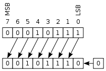

Here's a collection of problems about advanced algorithms. These are designed to reinforce your R programming skills while teaching you useful and applicable material.

PageRank
========

Fast primality testing
======================

Prime numbers are mathematically important because they form the "backbone" of the natural numbers, and hence have [many interesting and mysterious properties](http://math.stackexchange.com/questions/136450/why-do-we-consider-prime-numbers-important-and-what-are-their-applications-oth) which, if understood, give us deep insights into questions involving integers. Number theory was considered in the past to be the purest of the fields of mathematics, with no possible application to practical problems; however, in the modern era, primality testing (checking if a number is [prime](https://en.wikipedia.org/wiki/Prime_number) or [composite](https://en.wikipedia.org/wiki/Composite_number)) is of crucial importance because of its role in cryptography (which keeps your bank account, medical information, etc. safe).

Primality testing is in fact a classic algorithmic task, stretching all the way back to 200 BC with the [Sieve of Erastosthenes](https://en.wikipedia.org/wiki/Sieve_of_Eratosthenes) developed by [Erastosthenes of Cyrene](https://en.wikipedia.org/wiki/Eratosthenes). We will first implement the Sieve and then work toward writing an implementation of the [Miller--Rabin primality test](https://en.wikipedia.org/wiki/Miller%E2%80%93Rabin_primality_test), a modern test for primality known to be [very fast in practice](http://stackoverflow.com/questions/2586596/fastest-algorithm-for-primality-test) for reasonably small numbers.

The Miller--Rabin primality test
--------------------------------

In the Miller--Rabin primailty test, we test the primality of a number $n > 2$ as follows: Since $n$ is odd, $n-1$ must be even, so we can write $n-1 = 2^s \cdot d$, where $d$ is odd. (For example, if $n = 13$, then $n-1 = 12 = 2^2 \cdot 3$ with $s = 2$ and $d = 3$.) The Miller--Rabin primality test is based on the observation that if we can find a number $a$ such that $a^d \not\equiv 1 (\text{mod}\ n)$ *and* $a^{2^rd} \not\equiv -1 (\text{mod}\ n)$ for all integers $r$ in the range $0 \le r \le s-1$, then $n$ is not prime. Otherwise, $n$ is likely to be prime.

Note that the Miller--Rabin primality test, as formulated here for a specific value of $a$, is *probabilistic* rather than *deterministic* -- it cannot definitively establish that $n$ is prime. It can be made deteterministic by checking all $a \le 2 (\ln n)^2$. Better yet, when $n$ is sufficiently small, it [has been found](https://en.wikipedia.org/wiki/Miller%E2%80%93Rabin_primality_test#Deterministic_variants) that we only need to consider a couple different values of $a$; for example, for $n < 4,759,123,141$, we only have to check $a \in \{2, 7, 61\}$.

We have one more utility function to write:

* Write a function `decompose_even(n)` which takes as input an *even* integer `n` and returns a vector of two integers `c(s, d)` such that `n` is equal to `2^s * d` and `d` is odd.

With `decompose()` and `pow3()` from *Basic Algorithms* along with `decompose_even()`, we are now ready to implement the entire primality test.

* Following the above description, implement the deterministic Miller--Rabin test as `miller_rabin(n)` for $n < 4,759,123,141$, returning `TRUE` for a prime number and `FALSE` otherwise. Keep the following points in mind:

	* Checking if $x \equiv -1 (\text{mod}\ n)$ is equivalent to checking if $x \equiv n-1 (\text{mod}\ n-1)$.

	* The values of $a$ used are themselves prime but will not be evaluated as such by the algorithm, so they must be handled specially if passed in as input.

	* Make sure that the special case of 1 (which is a composite number) is handled properly.

	* You can verify that your implementation works correctly by combining it with [`Filter()`](https://stat.ethz.ch/R-manual/R-devel/library/base/html/funprog.html) to find the prime numbers from 1 to 100 and checking the output against that of the Sieve of Erastosthenes.

* Write a function `simple_check(n)` that checks if `n` is a prime by checking if `n` is divisible by any integers from 2 up to `floor(sqrt(b))`. Verify that `miller_rabin()` and `simple_check()` produce the same output for the first 10,000 integers.

A small primality problem
-------------------------

We can apply the Miller--Rabin primality test to solve a simple problem in computational number theory.

* Write a function `variations(n)` which takes in an integer `n` and returns a vector containing every number which can be obtained by changing a single digit of `n`.

* With `variations()` and the Miller--Rabin primality test, find a counterexample to the following statement: By changing at most a single digit of any positive integer, we can obtain a prime number.

Pseudorandom number generators
==============================

Being able to generate random numbers is very useful!

Unfortunately, random number generators are not truly random (unless you use expensive quantum hardware!) and are in fact [pseudorandom](https://en.wikipedia.org/wiki/Pseudorandom_number_generator), meaning that their output only *approximates* true randomness. A pseudorandom number generator (pRNG) takes a starting point, known as a *seed*, as input; a pRNG, given the same seed twice, will produce the exact same output in the exact same order both times. (R uses [inversion transform sampling](https://en.wikipedia.org/wiki/Inverse_transform_sampling) by default to generate random numbers.)

First, we will implement two [linear congruential generators](https://en.wikipedia.org/wiki/Linear_congruential_generator) (LCGs) in R. LCGs are one of simplest and fastest classes of pRNGs, but their results are also not very random -- we'll briefly take a look at one of their many weaknesses. In practice, they are useful in very specialized situations when only a very small amount of RAM is available, but perform *extremely* poorly when used for [Monte Carlo simulations](https://en.wikipedia.org/wiki/Monte_Carlo_method) because of the aforementioned weaknesses.

Afterward, we will undertake the implementation of a [xorshift](https://en.wikipedia.org/wiki/Xorshift) pRNG, one of the simplest and fastest classes of pRNGs which work by repeatedly taking the [bitwise XOR](https://en.wikipedia.org/wiki/Xorshift) of a number with [bit-shifted](https://en.wikipedia.org/wiki/Logical_shift) versions of itself. The speed of xorshift pRNGs results from the fact that the numerical operations involved are directly implemented by the CPU. (Regrettably, they do fail certain statistical tests for randomness because they are fundamentally based on [linear recurrences](https://en.wikipedia.org/wiki/Linear-feedback_shift_register).)

Linear congruential generators
------------------------------

A LCG is given by the sequence of numbers defined by $X_{n+1} = (a X_n + c) \mathrm{\ mod\ } m$ with the initial value $X_1$ as the seed. The following code implements LCGs in R:

```r
lcg = function(a, c, m, s) {
  function() {
    s <<- (a*s + c) %% m
    return(s)
  }
}
```

We can initialize a LCG for given values of $a$, $c$, and $m$ and an initial value $X_1 = s$ by calling `my_lcg = lcg(a, c, m, s)`. Afterward, we can generate random numbers by repeatedly calling `my_lcg()`.

* Read [Hadley Wickham's answer](http://stackoverflow.com/questions/2628621/how-do-you-use-scoping-assignment-in-r) about the `<<-` operator. Referring to that answer as necessary, read and understand the above code for `lcg()`, particularly (1) how `lcg()` is a function which *returns another function* and (2) how the `<<-` operator is used to maintain a consistent *state* for each instantiation of the pRNG for given values of $a$, $c$, $m$, and $X_1$.

* Initialize two different LCGs with $(a, c, m, s) = (53, 0, 127, 1)$ and $(a, c, m, s) = (85, 0, 127, 1)$. These two LCGs will generate random numbers from 0 to 126. For each one, generate 10,000 random numbers and plot a histogram of the values to verify that the output is uniformly distributed.

Checking for a uniform distribution is the simplest statistical test, but it is by no means the *only* statistical test we can apply to evaluate the quality of a pRNG. For example, we want the $i$th value of the pRNG to be completely independent of the $(i-1)$th value of the pRNG.

* Write a function `plotlag(v)` which takes as input a vector of random values $\textbf{v}$ and plots every pair of points $(\textbf{v}_{i-1}, \textbf{v}_i)$. (For a vector of length $n$, there are $n-1$ such pairs: $(\textbf{v}_1, \textbf{v}_2), (\textbf{v}_2, \textbf{v}_3), \ldots, (\textbf{v}_{n-1}, \textbf{v}_n)$).

* Use `plotlag()` on the outputs of the two LCGs you previously created. Which one seems better? (The less structure in the output of `plotlag()`, the better.)

Next, we'll implement the [RANDU](https://en.wikipedia.org/wiki/RANDU) pRNG, which is a linear congruential generator with the parameters $(a, c, m) = (65539, 0, 2^{31})$. It is notoriously bad. First, however, we have to figure out how to get around a problem: R can't natively work with integers larger than $2^{31}$, as can be seen from the evaluation of `log(.Machine$integer.max, 2)`. Although the *results* of RANDU are guaranteed to not be greater than $2^{31}$ (because they are taken modulo $2^{31}$), the *intermediate results* are multiplied by $65539 \approx 2^{16}$ and may be as large as $2^{16} \times 2^{31} = 2^{47}$.

Thankfully, we can use the [`Rmpfr`](https://cran.r-project.org/web/packages/Rmpfr/index.html) package to handle very large numbers. We can call `mpfr(x, precBits=k)` to turn `x` into a special type of number with precision up to `k` bits. Any further computations on the output of `mpfr()` can be carried out with extra-high precision; if the extra-high precision is no longer necessary, it can be converted back into a normal integer with [`as.numeric()`](https://stat.ethz.ch/R-manual/R-devel/library/base/html/numeric.html).

* Write a function `lcg_mpfr()` which is identical to `lcg()` with the exception of converting the seed, `s`, into a number with 50 bits of precision before returning the inner function.

* Create the RANDU LCG with `lcg_mpfr()`, seeded with an initial value of 1. Test its functionality by verifying that the 20th number generated is 1559239569. Generate 10,000 values with RANDU and check the results of `plotlag()`.

For a vector of random values $\textbf{v}$, instead of just looking at *pairs* of consecutive numbers $(\textbf{v}_{i-1}, \textbf{v})$ we can look at *triples* of consecutive numbers $(\textbf{v}_{i-2}, \textbf{v}_{i-1}, \textbf{v}_i)$.

* Use the `scatterplot3d()` function from the [`scatterplot3d`](https://cran.r-project.org/web/packages/scatterplot3d/index.html) package to plot all triples of consecutive values for the 10,000 numbers generated with RANDU. Pass in the argument `angle=150` when doing so.

Although there is no structure in the 2-dimensional plot of consecutive values, there is very clearly structure in the 3-dimensional plot of consecutive values. Checking for structure in such plots (for higher dimensions as well) is the basis of the [spectral test](https://en.wikipedia.org/wiki/Spectral_test), a test of the quality of pseudorandom number generators. RANDU passes the spectral test for 2 dimensions but fails the spectral test for dimensions 3 and higher.

In the next two sections, we'll consider the *xorshift* class of pRNGs, which is slower but substantially better than LCGs.

Bitwise operations in R
-----------------------

In order to write a xorshift pRNG, we first need to implement [bitwise operations](https://en.wikipedia.org/wiki/Bitwise_operation) in R.

Instead of operating with bits directly, we'll store binary representations of numbers as strings and operate on those, which will be quite slow but will better illustrate how bit shifts work. R does have [native bitwise operation functions](https://stat.ethz.ch/R-manual/R-devel/library/base/html/bitwise.html), but we'll implement our own versions for pedagogical purposes![^rbit]

[^rbit]: The behavior of base R's logical bit shift functions is a little annoying because they can end up changing the sign of a number; the numerical value is invariant modulo $2^{32}$ but having to correct for a shift of $2^{32}$ is too much complication for this present assignment.

Before we can even think of operating on bitwise representations of integers, we need functions which allow us to convert between [decimal](https://en.wikipedia.org/wiki/Decimal) and [binary](https://en.wikipedia.org/wiki/Binary_number) representations of integer! The binary representation of a number encodes it as sums of powers of 2; for example, the binary number "100101" is equal to $2^5 + 2^2 + 2^0$, because (counting from the right and starting at 0) the 0th, 2nd, and 5th positions in "100101" are 1s. Representations of integers as sums of powers of 2 are *unique*, meaning that no two numbers have the same binary representation.

* Write a function `to_binary(n)` which takes an integer `n` and returns its binary representation in a string with no leading zeroes (*e.g.*, "10100" instead of "0010100").

* Write a function `to_decimal(b)` which takes a binary representation `b` and returns the corresponding decimal integer. To handle large integers, return 

The bitwise XOR operation takes two binary numbers of equal length and outputs another number of the same length, where the $i$th position in the output is 1 if the $i$th positions in the two input numbers are different and 0 if they are the same. For example, $0101 \oplus 0011 = 0110$ and $0010 \oplus 1010 = 1000$.

* Implement bitwise XOR as `bitwise_xor(a, b)`. If the inputs are of different lengths, remember to pad the shorter binary number with zeroes on the left.

A logical left shift of $k$ bits can be thought of as discarding the leftmost $k$ digits of a binary number and appending $k$ zeroes to the right end. Similarly, a logical right shift of $k$ bits discards the $k$ rightmost digits and appends $k$ zeroes to the left end. (If $k$ is equal to or greater than the length of the binary number, then the entire number is placed with zeroes.)

{width=40%}

These operations are called *shifts* because of how they are carried out in the [CPU register](https://en.wikipedia.org/wiki/Processor_register).

* Implement left and right logical shifts of $k$ bits as `left_shift(b, k)` and `right_shift(b, k)`.

Implementing a xorshift pRNG
----------------------------

Now, we can implement an algorithm to generate a random positive 32-bit integer. In order for logical left shifting to work properly, our binary numbers must be long enough to encode 32 bits of information:

* Write a function `to_binary_len(n, k)` which converts an integer `n` to a binary representation and then pads it with 0s on the left until the length of the string is equal to `k`.

Finally, we are ready to implement a simple xorshift algorithm. It will take as input 4 *seed* values $x$, $y$, $z$, and $w$ which determine its initial state. In the following, let $x \ll n$ represent $x$ left logical shifted by $n$ bits, let $x \gg n$ represent $x$ right logical shifted by $n$ bits, and let $\oplus$ represent the bitwise XOR operation. The algorithm is as follows:

1. Set $t = x$.
2. Set $t = t \oplus (t \ll 11)$.
3. Set $t = t \oplus (t \gg 8)$.
4. Set $x = y$, $y = z$, and $z = w$.
5. Set $w = w \oplus (w \gg 19)$.
6. Set $w = w \oplus t$.
7. Return $w$.

At this point, you have everything you need to write a custom implementation of a xorshift pRNG! We'll restrict ourselves to 31-bit integers so that we don't have to use [`Rmpfr`](https://cran.r-project.org/web/packages/Rmpfr/index.html).

* Fill in the following code template for a `xorshift()` function:

	```r
	xorshift = function(x, y, z, w) {
	  # Convert x, y, z, w to 31-bit binary representations.
	  function() {
	    # Implement the xorshift algorithm, using <<- for
	    # assignment to x, y, z, w.

	    # Call return() here on the output.
	  }
	}
	```

	`xorshift()` will return a xorshift pRNG seeded with the specified values which can then be repeatedly called to generate random values, *e.g.*, `r = xorshift(0, 3, 93, 59); r();`. Verify that with $(x, y, z, w) = (1, 2, 3, 4)$ as the seed, the first three generated numbers are 2061, 6175, and 4. Generate 10,000 random numbers with xorshift and plot a histogram of their values. Apply the 2- and 3-dimensional spectral test to the generated values.