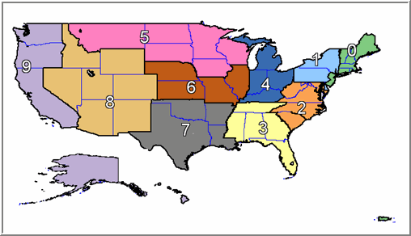

Some of the following problems are adapted from UC Berkeley curricular material.[^course]

[^course]: Specifically from [CS 61A: The Structure and Interpretation of Computer Programs](http://cs61a.org/).

You'll first work through a series of themed problems involving `WITH` statements and various aggregation operators. Afterward, you'll learn how to convert data frames in R into SQLite tables. Finally, you'll finish off with a series of short readings about advanced SQL techniques (foreign keys, window functions, etc.) which you'll be getting more practice with *next* weekend.

Refer to the [official SQLite documentation](https://www.sqlite.org/docs.html) when necessary. As you work, write down your queries in a separate file.

Celebrating the winter holidays
===============================

The following problems refer to `thanksgiving.sql` in the `sql-homework` datasets folder.

Booking flights home
--------------------

It's Thanksgiving! You want to book your flight home, but there's just one problem: everybody knows that as we get closer to Thanksgiving, the prices of airplane tickets shoot up for no good reason.

Assume that on November 1st, 2nd, and 3rd, your tickets home cost $20, $30, and $40 dollars respectively. What we want to do is find the prices you'll have to pay if you wait.

You have a friend in the airline business, so you know the following information about ticket prices in November: on an day after the 3rd, the price of a ticket is equal to the average of the previous two days, which is then added to 5 times the value of the numerical date (*i.e.*, 5th, 6th, etc.) mod 7 (to account for the fact that demand rises through the week).

For example, consider the price of tickets on November 16. If the price of a ticket on the 14th was $10 (this is not true in our model), and on the 15th it was $20, the average of those two prior days is $15. We then add that to 5*(16%7), which is 10. Thus, on the 16th tickets should be $25 (Yikes!).

* Output a table with the dates in November, from November 1st to 25th (the day before Thanksgiving), along with the ticket price on each day:

	| Day | Price |
	|-----|-------|
	| 1   | 20    |
	| 2   | 30    |
	| 3   | 40    |

	... and so on and so forth.

	*Hint:* You might notice that your output numbers are all whole numbers if you use the "/" operator to do your division (which is what we want you to do in this part). This is because SQL will only produce an integer data type when it divides two integer data types. Don't worry about that for this question: having only integer outputs is OK.

One of your friends has made the terrible mistake of booking Thanksgiving plane tickets late! However, your friend asked you to help find the best plane tickets for flying home in this darkest of hours. Of course, you'd like to find the cheapest flight possible, but regardless of the savings, you would also like to make sure you don't send your friend on too many flight transfers.

* To help your friend out, find the cheapest set of flights from SFO to PDX excluding options with more than two flights. You should generate a table with the following columns:

	* The set of airports that the flights pass through.

	* The total cost of a set of flights.

	Order your table from the cheapest to most expensive option. Be sure to watch out for infinite loops in your SQL query.

Planning a Thanksgiving dinner
------------------------------

It has finally fallen to you to do the Thanksgiving grocery shopping! You have been given a $60 budget, but you can't make up your mind on what to buy.

* You have access to all the possible things you could purchase as well as their costs in the `supermarket` table. Write a SQL query that outputs a table which lists of all possible ways you could fill your budget with delicious Thanksgiving foods. The final table should have 2 columns:

	* A comma-separated list of items ordered from least to most expensive.

	* The amount of your budget left over.

	Finally, order your results in ascending order of leftover budget. For lists that have the same remaining budgets, order them alphabetically.

Of course, part of planning a good Thanksgiving dinner is making sure there's enough variety on the dinner table.

* Modify your previous query so that you never pick more than two of any item.

Tragically, many people find themselves overeating during Thanksgiving. Let's try to plan a healthier meal.

You are given a table `main_course` where each row corresponds to a possible Thanksgiving meal with two components: the meat and the side dish (in an amazing display of restraint, you are limiting yourself to just one side dish). You are also given a second table `pies` containing different types of pies as well as their caloric content. The idea is that you will pair the two items consisting of your main course (a row of the table `main_course`) with a pie that you will have for dessert.

* Write a query to tell us how many different types of meats we have in our list of main courses.

* Write a query to count the number of "full" meals (i.e main course plus a pie) we can make with *strictly fewer than* 2500 calories total. For example, if you have turkey and cranberries along with pumpkin pie, you will have 2000 + 500 = 2500 calories total (2000 from the main course, 500 from the pie).

We are mainly concerned with what meat is in our planned meal. For every type of meat, we want to see how healthy a meal containing that type of meat can be.

* Write a query to output a table with two columns: meat and total calories. Each row should correspond to the caloric content of the healthiest meal involving each type of meat. Also, if it is possible to make *any* full meal of strictly more than 3000 calories (even just one) using a certain type of meat, then temptation will surely take over. For this reason, *exclude* such types of meat from your table.

	*Hint:* You shouldn't need to do anything special to choose among several possible healthiest meals, but for completeness you can choose the side with the cranberries.

Shopping for gifts
------------------

After you are full from your Thanksgiving dinner, you realize that you still need to buy gifts for all your loved ones over the holidays. However, you also want to spend as little money as possible.

* Let's start off by surveying our options. Using the `products` table, write a query that outputs a table which lists product categories and the average price of items in each category.

Now, you want to figure out with stores sell each item in products for the lowest price.

* Write a query that uses the inventory table to *create* a table `lowest_prices` which lists (1) items, (2) the store that sells that item for the lowest price, and (2) the price at which that item is sold in the chosen store.

You want to make a shopping list by choosing the item that is the best deal possible for every category. For example, for the "phone" category, the uPhone is the best deal because the MSRP of a uPhone divided by its ratings yields the lowest cost. That means that uPhones cost the lowest money per rating point out of all of the phones.

* Using the `lowest_prices` table created in the previous question, write a query to *create* a table `shopping_list` which lists the items that you want to buy from each category. After you've figured out which item you want to buy for each category, add another column that lists the store that sells that item for the lowest price.

Finally, you'll be shopping online, of course. Bandwidth costs money, so you'd like to minimize the amount of Internet traffic used. The MiBs column in the `stores` table contains information about how much bandwidth is consumed by accessing each store's online page to buy a *single* type of item.

* Write a query to calculate the total amount of bandwidth needed to get everything in your shopping list.

Happy Holidays!

Using SQL queries with MovieLens data
=====================================

We can also use SQL queries to look at movie ratings.

* Following [R and SQLite: Part 1](https://www.google.com/url?hl=en&q=http://www.r-bloggers.com/r-and-sqlite-part-1/), convert the [MovieLens 1M Dataset](http://grouplens.org/datasets/movielens/1m/) into a single SQLite database with 3 tables (one for each of users, movies, and ratings). Save the database into a `.db` file on your computer.

Write queries using your newly created SQLite database to solve the following problems. You can either continue running SQLite directly from the command line as you've been doing thus far or switch to using a GUI like [SQLite Studio](http://sqlitestudio.pl/) to view tables and enter queries. Depending on how you created your SQLite database, you may find `SUBSTR()`, `ROUND()`, `CAST()`, or the `LIKE` operator useful.

* Determine the number of movies released in each year, omitting those with no date listed.

	Interpret the results. Why are there fewer movies listed as being released in 2000 than in the preceding 7 years? Why are some listed years earlier than the year when movies were invented?

* Determine the percent of movies released each year which are dramas. Order the result by putting more recent years at the top.

	Make an educated guess about why the fraction has been more stable in recent years than it had been been in the 1920’s and 1930’s. You may find the results of the query in (a) useful for this.

* Determine the number of movies with titles beginning with the same first letter for the 5 most frequently occurring first letters in titles.

	Compare with the [most common first letters of the English language](https://en.wikipedia.org/wiki/Letter_frequency#Relative_frequencies_of_the_first_letters_of_a_word_in_the_English_language). How many of the results of the SQL query are in the top 5? In the top 10?

* For each digit (0 to 9), determine the percent of users with a zip code which begins with that digit.

	Compare with the geographic boundaries in the following diagram:[^diag]

	{width=75%}

	Would you expect the percents given by the SQL query to correspond to the percents of the US population in each region depicted?

[^diag]: Image from [ZIP Code FAQs](http://www.zipboundary.com/zipcode_faqs.html).

* Find the average movie rating for users in each of the different age categories. Repeat with users of different genders and or occupations.

* Explore which movies are rated highest for users of different age, sex, or occupation. In the output of your queries, include both average rating and the *number* of ratings to get a sense for the statistical robustness of the calculated average.

Reading about advanced SQL topics
=================================

Finally, we'll prepare for next week's SQL homework assignment by doing a little bit of reading. Please read through the following:

* [Chapter 3](https://www.postgresql.org/docs/9.1/static/tutorial-advanced.html) of the PostgreSQL documentation

* [SQL Window Functions](https://community.modeanalytics.com/sql/tutorial/sql-window-functions/) by Mode Analytics

* [Probably the Coolest SQL Feature: Window Functions](https://blog.jooq.org/2013/11/03/probably-the-coolest-sql-feature-window-functions/)