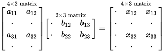

This document is an exposition of the method of alternating least squares (ALS) for imputation of missing values. The reference is Hastie *et al.* (2014), [Matrix Completion and Low-Rank SVD via Fast Alternating Least Squares](http://arxiv.org/abs/1410.2596); ALS is implemented in the `softImpute` package in R.

Theory
======

The operation of [matrix multiplication](https://en.wikipedia.org/wiki/Matrix_multiplication) allows us to *multiply* two matrices and form a new matrix. It is illustrated below:

{width=50%}

Note specifically the dimensions of the resulting matrix. If $\textbf{A}$ is an $n \times p$ matrix and $\textbf{B}$ is a $p \times m$ matrix, the product $\textbf{A}\textbf{B}$ will have dimensions $n \times m$.[^dim] What if $p$ is very small compared to $n$ and $m$? We will be able to obtain quite a large matrix just from multiplying together two very narrow matrices (one tall and one wide).

[^dim]: If the matrices all have real values, we can write $\textbf{A} \in \mathbb{R}^{n \times p}$, etc.

In general, we find that it is possible to [decompose](https://en.wikipedia.org/wiki/Matrix_decomposition) large matrices into the *product* of multiple *smaller* matrices. This is the key behind the method of alternating least squares.

The task at hand is that given a matrix $\textbf{X}$ with many missing entries, we want to construct a filled-in matrix $\textbf{Z}$ which *minimizes some loss function*. It turns out that we can write a *regularized* cost function which makes this task straightforward, and also that we can write the solution which minimizes the cost function as

$$\textbf{Z} \approx \textbf{A} \textbf{B}^\intercal$$

for an appropriate choice of a tall matrix $\textbf{A}$ and a wide matrix $\textbf{B}^\intercal$, where the operator $\intercal$ denotes the *transpose* of a matrix, (flipping a $n \times m$ matrix so that its dimensions become $m \times n$). Note that for the existing data in $\textbf{X}$ we simply use that rating data directly in the filled-in matrix $\textbf{Z}$ instead of the approximated values in $\textbf{A} \textbf{B}^\intercal$ (hence the $\approx$ symbol).

Our imputation method is an indirect one in the sense that instead of *directly* trying to calculate missing values from existing ones, we ask what the optimal filled-in matrix $\textbf{Z}$ would look like and infer the missing values based on an analysis of $\textbf{Z}$. Precisely, we are trying to minimize the differences between the filled-in entries of $\textbf{X}$ and the corresponding entries of $\textbf{A} \textbf{B}^\intercal$ along with a regularization term controlled by a parameter $\lambda$.[^deg] Our cost function only considers the matrix entries which correspond to existing data (the filled-in values of $\textbf{X}$), but the fashion in which we estimate $\textbf{A}$ and $\textbf{B}$ operate on the *entirety* of each matrix. Consequently, the entries of $\textbf{A} \textbf{B}^\intercal$ corresponding to *missing* data in $\textbf{X}$ serve as rating estimates.

[^deg]: One can ask the question of why we don't simply estimate $\textbf{A} = \textbf{B} = \textbf{0}$ in the degenerate case of $\textbf{X}$ having *no* missing values. If that were the result, it would contradict the fact that $\textbf{A} \textbf{B}^\intercal$ should be equal to the soft-thresholded SVD of $\textbf{Z}$ (presented later in this exposition)! The reason is that although $\textbf{A} \textbf{B}^\intercal$ contains information about the *differences* between $\textbf{X}$ and $\textbf{Z}$, we don't try to impute those differences directly (in which case we might stop immediately if there were no differences whatsoever) but rather *infer* them by trying to bring $\textbf{X}$ and $\textbf{A} \textbf{B}^\intercal$ closer together.

Our task is now simply to estimate the matrices $\textbf{A}$ and $\textbf{B}$. It turns out that the optimal estimates are related via the equation

$$\textbf{B} = \left( \textbf{A}^\intercal \textbf{A} + \lambda \textbf{I} \right)^{-1} \textbf{A}^\intercal \textbf{Z}$$

and vice versa with $\textbf{A}$ and $\textbf{B}$ switched, where $\lambda$ is the regularization parameter and $\textbf{I}$ is the identity matrix.[^iden] For mathematical reasons, this is actually equivalent to running a regularized[^ridge] least squares regression for each column of $\textbf{Z}$ with the columns of $\textbf{A}$ as predictors, with the coefficient estimates corresponding to entries of $\textbf{B}$![^check]

[^iden]: The identity matrix is a matrix with 1 on the diagonal and 0 elsewhere. Multiplying it by a different matrix leaves that matrix unchanged.

[^ridge]: Specifically, this is equivalent to using [Tihkonov regularized linear regression](https://en.wikipedia.org/wiki/Tikhonov_regularization) with Tikhonov matrix $\Gamma = \left( \lambda \textbf{I} \right)^{1/2}$. This is also called *ridge regression* and reduces to $L^2$ regularization in the case where $\Gamma$ is the identity matrix. We are essentially running a linear regression of each column of $\textbf{Z}$ with the columns of $\textbf{A}$ as predictors and getting $\textbf{B}$ back as the coefficient estimates.

[^check]: We can check that the dimensions match up. Suppose that $\textbf{Z} \in \mathbb{R}^{n \times p}$, $\textbf{A} \in \mathbb{R}^{n \times f}$, and $\textbf{B} \in \mathbb{R}^{p \times f}$. Then the columns of $\textbf{Z}$ and $\textbf{A}$ all have $n$ entries each, and so we can run $p$ different linear regressions (one for each column of $\textbf{Z}$) and get out $f$ coefficient estimates each time. We therefore estimate $p \times f$ different coefficient estimates in total, which matches up with the dimensions of $\textbf{B}$.

As such, this suggests a strategy for estimating $\textbf{A}$ and $\textbf{B}$. First, we start by initializing $\textbf{A}$. Next, we use the regression strategy described above both to generate predictions for $\textbf{Z}$ and to generate an estimate for $\textbf{B}$. Next, we can switch the places of $\textbf{A}$ and $\textbf{B}$ in the above equation and use the same process to update $\textbf{Z}$ and $\textbf{A}$. We repeat in this *alternating* fashion until we achieve convergence.

Soft-thresholded SVD
====================

After running the algorithm described above, `softImpute()` returns the imputed matrix $\textbf{Z}$ in a *special form*. It turns out that the product $\textbf{A} \textbf{B}^\intercal$ is related to $\textbf{Z}$ in yet another fashion!

Taking a step back: in general, *all* matrices can be decomposed into a product of the form $\textbf{U} \textbf{D} \textbf{V}^\intercal$ called the [singular value decomposition](https://en.wikipedia.org/wiki/Singular_value_decomposition) (SVD) where $\textbf{D}$ is a diagonal matrix (the only nonzero entries are on the diagonal). We can compute a *modified* version of the SVD for $\textbf{Z}$ called the *soft-thresholded SVD* formed by taking $\textbf{D}$ and shrinking the entries on its diagonal toward 0 by a value $\lambda$, setting an entry $d_i$ equal to 0 if $\lvert d_i \rvert \le \lambda$.[^soft] With the modified matrix $\textbf{D}^\star$, we can compute the soft-thresholded SVD as $S_\lambda(\textbf{Z}) = \textbf{U} \textbf{D}^\star \textbf{V}^\intercal$.

[^soft]: Soft-thresholding is basically solving a $L^1$ regularized cost function very rapidly by looking at the first derivative. Refer back to the theoretical discussion in *Linear Regression: Regularization* for some related details. We can therefore think of soft-thresholded SVD as a sort of $L^1$ regularized version of SVD which shrinks the singular values closer to 0.

The connection between $\textbf{A} \textbf{B}^\intercal$ and $\textbf{Z}$ lies in the somewhat remarkable relation

$$\textbf{A} \textbf{B}^\intercal = S_\lambda(\textbf{Z})$$

for the optimal estimates of $\textbf{A}$ and $\textbf{B}$.

Indeed, `softImpute()` will return three matrices as `$u`, `$d`, and `$v`, corresponding to the matrices in $S_\lambda(\textbf{Z}) = \textbf{U} \textbf{D}^\star \textbf{V}^\intercal$. From those, we also know $\textbf{A} \textbf{B}^\intercal$, and so the imputed matrix $\textbf{Z} \approx \textbf{A} \textbf{B}^\intercal$ can be calculated.

Dimensionality reduction
========================

From the definition of the soft-thresholded SVD, we see that increasing $\lambda$ sufficiently high will make every value in $\textbf{D}^\star$ equal to 0. The immediate takeaway is that by calculating the maximum value in $\textbf{D}$, we can establish an *upper bound* for the values of $\lambda$ to test. However, there is a more important and subtler interpretation of the results of ALS in connection with the regularization parameter.

It is likely that the optimal value of $\lambda$ is one which drives some *but not all* of the values in $\textbf{D}$ to 0. An $n \times n$ diagonal matrix with a *rank* of $k$, *i.e.*, $k$ nonzero values on the diagonal can simply be rewritten as a $k \times k$ diagonal matrix without any nonzero values on the diagonal. Our decomposition then becomes the product of (1) $\textbf{U}$ (a tall $n \times f$ matrix), (2) $\textbf{D}^\star$ (a small square $f \times f$ matrix), and (3) $\textbf{V}^\intercal$ (a wide $f \times m$ matrix) for some small value of $f$. We can interpret this as being able to *summarize* both users and movies in terms of $f$ factors, with the columns of $\textbf{U}$ being factor scores for users and the rows of $\textbf{V}^\intercal$ being factor scores for movies.

If a user has factor scores $\textbf{u} = (u_1, u_2, \ldots, u_f)$, a movie has factor scores $\textbf{m} = (m_1, m_2, \ldots, m_f)$, and the diagonal entries of $\textbf{D}^\star$ are given by $\{d_1, d_2, \ldots, d_f\}$, then the predicted rating for that user--movie pair is simply given a [weighted inner product](https://en.wikipedia.org/wiki/Inner_product_space) of $\textbf{u}$ and $\textbf{m}$ equal to

$$\langle \textbf{u}, \textbf{m} \rangle = \textbf{u}^\intercal \textbf{D} \textbf{m} = \sum_{i=1}^f u_i d_i m_i.$$