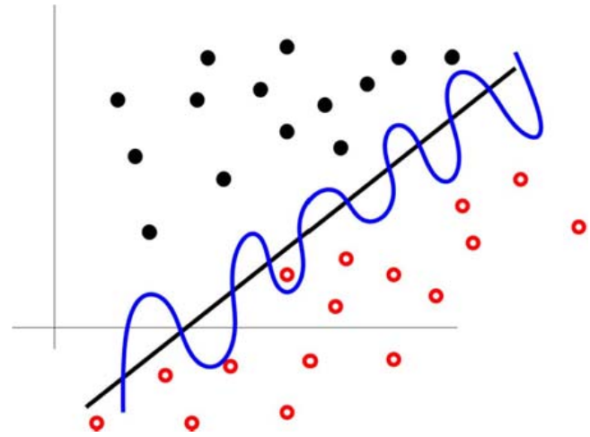
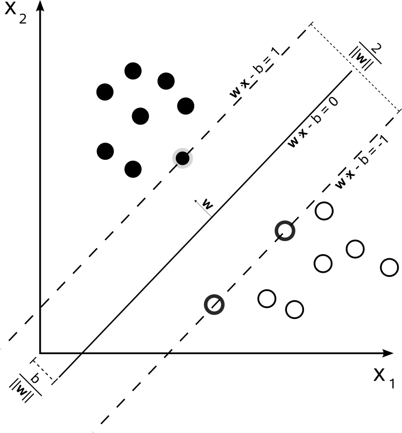
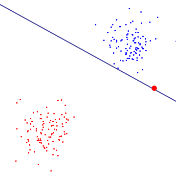
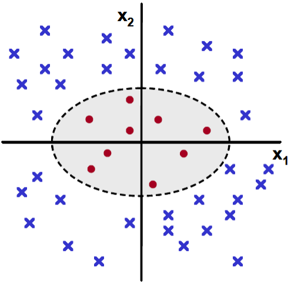
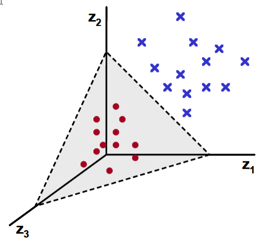

The task of *classification* is fundamental to the history and development of machine learning because the simplest machine learning problem possible is binary classification: determining whether data falls into one class or the other.

Generative vs. discriminative methods
=====================================

The novice data scientist can easily fall into the trap of considering different techniques to be more-or-less disconnected and unrelated, as if machine learning were a "grab bag" of models and algorithms, each with its own odd little quirks and nuances. This is not the case! There is **structure** in this world.

Of particular importance is the distinction between **generative vs. discriminative** approaches. A generative approach models the way in which the observed data were generated in order to perform classification on new data, whereas a discriminative approach doesn't care about how the data was generated: it is *purely* concerned with the problem of classifying new data.

To make this precise, suppose that we wish to predict the label $y$ from the training data $x$. In a *discriminative* approach, we are concerned with evaluating $y^\star = \mathop{\mathrm{arg\, max}}_y P(y \mid x)$, that is, finding the most likely class label $y^\star$ given the data $x$. The only concern is how we can distinguish one class from another using $x$.

However, we can use Bayes' rule to rephrase our problem. Since $P(y \mid x) = P(x \mid y) P(y) / P(x)$, we have $y^\star = \mathop{\mathrm{arg\, max}}_y P(x \mid y)P(y)/P(x)$. However, the value of $y$ which maximizes $P(x \mid y)P(y)/P(x)$ is the same as the value of $y$ which maximizes $P(x \mid y)P(y)$, because $P(x)$ does not change with $y$.

As such, we can reformulate the problem as the evaluation of $y^\star = \mathop{\mathrm{arg\, max}}_y P(x \mid y) P(y)$. This corresponds to a *generative* model, because we are directly estimating the value of $P(y)$, that is, explicitly modeling the distribution of each class in order to perform classification.

Philosophical importance
------------------------

Instead of just being two equivalent formulations of the same underlying problem, the distinction between generative and discriminative modeling is very philosophically fundamental. To quote [V. N. Vapnik](https://en.wikipedia.org/wiki/Vladimir_Vapnik):

> The philosophy of science has two different points of view on the goals and the results of scientific activities.
> 
> 1. There is a group of philosophers who believe that the results of scientific discovery are the real laws that exist in nature. These philosophers are called the *realists*.
> 
> 2. There is another group of philosophers who believe the laws that are discovered by scientists are just an instrument to make a good prediction. The discovered laws can be very different from the ones that exist in Nature. These philosophers are called the *instrumentalists*.
> 
> The two types of approximations defined by classical discriminant analysis (using the generative model of data) and by statistical learning theory (using the function that explains the data best) reflect the positions of realists and instrumentalists in our simple model of the philosophy of generalization, the pattern recognition model. Later we will see that the position of philosophical instrumentalism played a crucial role in the success that pattern recognition technology has achieved.

Considering classification alone, we can state this in a more precise fashion. Suppose that we have a black box, $\mathcal{B}$, which when given an input vector $\textbf{x}_i$ returns an output $y_i = \{-1,+1\}$. Given the training data $(y_i, \textbf{x}_i)$, $i = 1, \ldots, n$, the task of *binary classification* is to find a function which best approximates whatever rule the black box $\mathcal{B}$ is internally using to perform the operation $\textbf{x}_i \mapsto y_i$.

There are two different ideas of what a *good approximation* means:

1. A good approximation of $\mathcal{B}$ is a function that is *similar in function space*, like how $\sin 2x$ is similar to $\sin 2.1x$, to the function which $\mathcal{B}$ uses to map $\textbf{x}_i \mapsto y_i$.
2. A good approximation of $\mathcal{B}$ is a function that is *numerically similar* to the function which $\mathcal{B}$ uses, giving approximately the same error rate of classification as $\mathcal{B}$ itself.

{width=65%}

The first definition is concerned with approximating the *true function*. The second definition is only concerned with *minimizing the error rate*.

Practical importance
--------------------

This distinction is not just of philosophical importance; it carries practical significance:

> [I]ll-posed problems can occur when one tries to estimate *unknown reasons from observed consequences*.

That is to say, problems that are very computationally difficult to solve -- where a small change in the observed data can lead to (discontinuously) large changes in the solution -- are very often precisely the problems which occur when we try to use a *generative* model. If the solver possesses "very strong prior knowledge about the solution", or if the solver makes very strong prior *assumptions*, then generative models become much more tractable, but this is not always feasible.

Vapnik writes:

> Keeping in mind the structure of ill-posed problems our problem of finding the [solution for $\mathcal{B}$] can be split into two stages:
> 
> 1. Among a given set of admissible functions find a subset of functions that provides an expected loss that is close to the minimal one.
> 2. Among functions that provide a small expected loss find one that is close to the $\mathcal{B}$ function.
> 
> The first stage does not lead to an ill-posed problem, but the second stage might (if the corresponding operator is unstable).
> 
> The realist view requires solving both stages of the problem, while the instrumentalist view requires solving only the first stage and choosing for prediction any function that belongs to the set of functions obtained.

The shift from the realist view to the instrumentalist view marked a significant advance in the development of machine learning.

Discriminant methods
====================

[Ronald Fisher](https://en.wikipedia.org/wiki/Ronald_Fisher)'s method of *discriminant analysis* is one of the earliest classification methods.

The idea behind discriminant analysis is that we posit a *generative model* for our data, where each of the two classes is generated from a multivariate normal distribution, and attempt to estimate the parameters of those distributions with the training data. With the parameters, we construct a *discriminant function* which gives us a decision boundary separating the two classes (hopefully).

With $p$-dimensional data, for each of the $p$ dimensions we must estimate the *mean* of both distributions. In addition, we have *covariance* terms to estimate: for each distribution, we must estimate the covariance of the first dimension with the second, the covariance of the first with the third, the covariance of the second with the third, and so on and so forth.

* In $p$-dimensional space, how many parameters do we have to estimate for a generative model positing that our two classes of data are generated by multivariate normal distributions?

Overview of derivation
----------------------

The most important information to take away from the derivations of discriminant analysis is the *set of assumptions* which underlies each method.

For binary classification, we first assume that the data from each class is drawn from a multivariate normal distribution. From this assumption alone, we can predict class membership from looking at whether or not the logarithm of the ratio of the likelihoods exceeds a certain threshold.

After simplification, we reduce to the following criterion for membership in class $+1$ (as opposed to class $-1$) where $\boldsymbol{mu}$, $\Sigma$, and $T$ represent distribution means, covariance matrices, and the threshold value:

$$\left[ \left( \textbf{x} - \boldsymbol{\mu}_{+1} \right)^\mathbf{\intercal} \Sigma_{+1}^{-1} \left( \textbf{x} - \boldsymbol{\mu}_{+1} \right)^\mathbf{\intercal} - \left( \textbf{x} - \boldsymbol{\mu}_{-1} \right) \Sigma_{-1}^{-1} \left( \textbf{x} - \boldsymbol{\mu}_{-1} \right) \right] + \left[ \ln \frac{ \mid \Sigma_{+1} \mid }{ \mid \Sigma_{-1} \mid } \right] > T.$$

There are quadratic terms on the left-hand side of the inequality, with entries of $\textbf{x}$ being multiplied with other entries of $\textbf{x}$, so this is called **quadratic discriminant analysis**.

We can further simplify this expression by making the assumption that the two distributions have the same covariance matrix. In this case, the above criterion reduces to the form

$$\textbf{w} \cdot \textbf{x} > c$$

for a vector of weights $\textbf{w}$ and a constant threshold $c$ which can be calculated from the parameters of the multivariate normal distributions.

Note that the left-hand side of the inequality is linear with respect to $\textbf{x}$. As such, we call this **linear discriminant analysis**.

Feel free to skip the following section on the mathematical derivation of QDA and LDA if you find it too technically demanding.

Mathematical derivation
-----------------------

Suppose that we have $p$-dimensional data points $\textbf{x}_i$, each with a binary class label $y_i \in \{-1, +1\}$. We make the assumption that the probability distribution for each class, $P(\textbf{x} \mid y = -1)$ and $P(\textbf{x} \mid y = +1)$, are both normally distributed with means and covariances $(\boldsymbol{\mu}_{-1}, \Sigma_{-1})$ and $(\boldsymbol{\mu}_{-1}, \Sigma_{+1})$ respectively.

With this assumption alone, we are ready to look at the the *log-likelihood* of class membership. Specifically, we can predict class membership to be $+1$ if the log of the ratio of the likelihoods is above some threshold $T$, that is,

$$\log \frac{P(\textbf{x} \mid y = +1)}{P(\textbf{x} \mid y = -1)} > T.$$

Since we assumed that both probability densities are multivariate normal distributions, they have the functional form

$$P(\textbf{x} \mid y = +1) = \frac{1}{(2\pi)^{p/2}  \mid \Sigma_{+1} \mid ^{1/2}} \exp \left( -\frac{1}{2} \left( \textbf{x} - \boldsymbol{\mu}_{+1} \right)^{\mathbf{\intercal}} \Sigma_{+1}^{-1} \left( \textbf{x} - \boldsymbol{\mu}_{+1} \right) \right).$$

As such, after taking the logs and simplifying, we have the following criterion for membership in class $+1$:

$$\left[ \left( \textbf{x} - \boldsymbol{\mu}_{+1} \right)^\mathbf{\intercal} \Sigma_{+1}^{-1} \left( \textbf{x} - \boldsymbol{\mu}_{+1} \right)^\mathbf{\intercal} - \left( \textbf{x} - \boldsymbol{\mu}_{-1} \right) \Sigma_{-1}^{-1} \left( \textbf{x} - \boldsymbol{\mu}_{-1} \right) \right] + \left[ \ln \frac{ \mid \Sigma_{+1} \mid }{ \mid \Sigma_{-1} \mid } \right] > T.$$

As it stands, the classification of points with the above criterion is called **quadratic discriminant analysis** (QDA), because of the [cross terms](http://math.stackexchange.com/questions/125435/what-is-the-opposite-of-a-cross-term) in the multiplication which lead to [quadric decision boundaries](https://en.wikipedia.org/wiki/Quadric).

We can *further* assume that the covariances of the two distributions are equal,[^rank] so $\Sigma = \Sigma_{-1} = \Sigma_{+1}$. After further simplification, we obtain the criterion

[^rank]: We also assume that the covariance matrices have full rank.

$$\textbf{w} \cdot \textbf{x} > c,$$

where

$$\textbf{w} = \Sigma^{-1} \left( \boldsymbol{\mu}_{-1} - \boldsymbol{\mu}_{+1} \right)$$

and

$$c = \frac{1}{2} \left( T - \boldsymbol{\mu}_{+1}^\mathbf{\intercal} \Sigma^{-1} \boldsymbol{\mu}_{+1}^\mathbf{\intercal} + \boldsymbol{\mu}_{-1}^\mathbf{\intercal} \Sigma^{-1} \boldsymbol{\mu}_{-1}^\mathbf{\intercal} \right).$$

This time, our solution is *linear* in $\textbf{x}$, and accordingly is named **linear discriminant analysis** (LDA).

Note that the criterion $\textbf{w} \cdot \textbf{x} > c$ is equivalent to specifying that $\textbf{x}$ must be on a particular side of a *hyperplane* parameterized by $\textbf{w}$ and $c$. We can see this by realizing that the dot product $\textbf{w} \cdot \textbf{x}$ is proportional to the [projection](https://en.wikipedia.org/wiki/Projection_(linear_algebra)) of vector $\textbf{x}$ onto vector $\textbf{w}. As such, if the dot product is positive, then $\textbf{x}$ is on one side of a hyperplane orthogonal to $\textbf{w}$, and if it negative, than $\textbf{x}$ is on the other side of the hyperplane.

Effectively, LDA finds a *separating hyperplane* which divides the two classes of training data, with slope and position set by $\textbf{w}$ and $c$.

Estimating parameters
---------------------

The QDA and LDA criterion depend on knowing the covariances $\Sigma_{-1}$ and $\Sigma_{+1}$ (or just $\Sigma$) as well as the means $\boldsymbol{\mu}_{-1}$ and $\boldsymbol{\mu}_{+1}$ of the two multivariate distributions which we assume generate our data.

In practice, we do not actually know the true values of these parameters, but we can estimate them using the [sample mean and covariance](https://en.wikipedia.org/wiki/Sample_mean_and_covariance) of our training data.

There is no general rule for choosing the value of the threshold $T$. If the data are projected onto $\textbf{w}$, the one-dimensional distribution of projections can be analyzed to choose the threshold which seems to best separate the data.

Intuition
---------

We will consider just LDA for simplicity, but the intuition here can be extended to QDA as well.

We know that LDA finds a hyperplane which is supposed to separate the two classes of data. However, what can we say about the properties of this hyperplane?

Since LDA works with the assumption that the two distributions (one corresponding to each class) are multivariate normal distributions, it effectively finds a separating hyperplane which does the following:

1. Maximizes the between-class variation, and
2. Minimizes the within-class variation.

"Variation" in the above refers to the notion of [Mahalanobis distance](https://en.wikipedia.org/wiki/Mahalanobis_distance), which measures the distance between a point and distribution.

Because of the generative nature of the model, LDA works well when the underlying data really are drawn from multivariate normal distributions. Moreover, since the *between-class variation* is implicitly minimized by LDA, the two classes are well separated. However, if the means of the distributions are close together, LDA will struggle to find a good separating hyperplane.

Moreover, QDA needs to estimate many more parameters than LDA, so it often requires more data. If the covariances of the underlying distributions are very dissimilar, then QDA will eventually perform better than LDA; however, in cases where the covariance matrices are relatively similar, it is possible that LDA will perform better than QDA up until a very high sample size is achieved.

Logistic regression
===================

You already have substantial experience applying logistic regression in a computational sense. This section has two goals: first, to demonstrate further how logistic regression fits into the framework of classification and machine learning as a whole; second, to provide more refinement to your intuitions about how logistic regression works.

Like discriminant analysis, logistic regression is a *generative* method, which makes certain assumptions about the distributions from which the data are drawn. Instead of beginning with linear regression as motivation and developing logistic regression, we will instead begin from the standpoint of trying to answer the question: "How can we improve linear discriminant analysis?" Beautifully, we will see that the answers coincide.

For a review of the standard exposition of logistic regression, see Chapter 11 in [Advanced Data Analysis from an Elementary Point of View](http://www.stat.cmu.edu/~cshalizi/ADAfaEPoV/ADAfaEPoV.pdf).

Mathematical derivation
-----------------------

The difficulty of the following mathematical exposition will vary from paragraph to paragraph. If you get caught up on understanding a specific statement, it's better to move on and return to it later.

I had the pleasure of learning this derivation from [*Statistical Methods for Pharmaceutical Research Planning*](https://books.google.com/books?id=CdmaIo7gSn8C&pg=PA42&lpg=PA42&dq=nonparametric+separating+hyperplane&source=bl&ots=pNeIqlt8-y&sig=u8Irqpume1O2IAv0RfIYoTabh3g&hl=en&sa=X&ved=0ahUKEwjt1-Lc64LNAhUK6mMKHZF1BGIQ6AEIMzAF#v=onepage&q=nonparametric%20separating%20hyperplane&f=false) by Bergman and Gittins (1985).

The motivation behind the following derivation of logistic regression is the consideration of instances where the two classes in binary classification are *not* sampled from multivariate normal distributions with equal covariances. That is, we would like to relax the assumptions of LDA to allow for probability densities that are not normal.

In particular, instead of assuming that $P(\textbf{x} \mid y = i) \propto \mathcal{N}(\boldsymbol{\mu}_i, \Sigma)$ for $i \in \{-1, +1\}$, where $\mathcal{N}(\boldsymbol{\mu}_i, \Sigma)$ denotes a multivariate normal distribution with mean $\boldsymbol{\mu}_i$ and covariance matrix $\Sigma$, we posit that

$$P(\textbf{x} \mid y = i) \propto \mathcal{N}(\boldsymbol{\mu}_i, \Sigma) \phi(\textbf{x}).$$

We relax our assumptions by saying that each of the two classes is drawn from a distribution equal to the *product* of a multivariate normal distribution with some unknown function $\phi(\textbf{x})$.

The *discriminant functions* -- that is, the essential inequalities which define QDA and LDA -- stay the same! This is because in their derivations we take the *ratio* of the probability densities for the two classes, so the function $\phi(\textbf{x})$ cancels and disappears. However, this is *not* a free lunch. A more subtle problem arises: the sample means and covariances, which we originally used as approximations to the parameters of the underlying multivariate normal distributions, are no longer the maximum likelihood estimators for those parameters in this more complex situation where we multiply the multivariate normal distribution by $\phi(\textbf{x})$ (unless $\phi(\textbf{x}) = 1$).

We will pause for a brief interlude in order to consider the [likelihood function](https://en.wikipedia.org/wiki/Likelihood_function) $\mathcal{L}$ directly. The function $\mathcal{L}(\textbf{x}, \boldsymbol{\theta})$ with respect to a collection of parameters $\boldsymbol{\theta}$ is equal to *the probability of observing the data $\textbf{x}$ given the parameter values $\boldsymbol{\theta}$ for the underlying distributions from which the data are generated*. To do *maximum likelihood estimation* of the parameters, we find the combination of parameters which maximizes $\mathcal{L}$.

Now, let us represent the training data as $T = T_{-1} \cup T_{+1}$, where $T_{-1}$ and $T_{+1}$ respectively represent the subsets of the training data labeled as class $-1$ and $+1$. The likelihood function for the generative model we are considering is given by

$$\mathcal{L} = \prod_{\textbf{x} \in T_{-1}} \left[ P(\textbf{x} \mid y = -1) P(y = -1) \right] \prod_{\textbf{x} \in T_{+1}} \left[ P(\textbf{x} \mid y = +1) P(y = +1) \right].$$

Again, we can intuitively think of this as being the *probability of observing the data which we observed given the parameters of the underlying distributions*, where the parameters are implicitly encoded in the probabilities $P(y = -1)$ and $P(y = +1)$.

Expanding out the probabilities, we obtain

$$\mathcal{L} = \prod_{\textbf{x} \in T_{-1}} \left[ \gamma_{-1} P(y = -1) \mathcal{N}(\boldsymbol{\mu}_{-1}, \Sigma) \phi(\textbf{x}) \right] \prod_{\textbf{x} \in T_{+1}} \left[ P(y = +1) \mathcal{N}(\boldsymbol{\mu}_{+1}, \Sigma) \phi(\textbf{x}) \right]$$

by substituting in the explicit expressions for the distributions of each class, where the constants $\gamma_{-1}$ and $\gamma_{+1}$ are chosen so that the distributions properly integrate to 1. To extend the method of discriminant analysis even further, in the case where the function $\phi(\textbf{x})$ is known we can maximize the likelihood function above and obtain the parameters of the multivariate normal distributions. However, the difficulty of this will vary depending on the form of $\phi(\textbf{x})$.

We have more or less run into the limits of how far discriminant analysis can take us without using substantially more sophisticated methods. However, we can develop the method of *logistic classification* by first rewriting the likelihood function as follows:

$$\mathcal{L} = \prod_{\textbf{x} \in T} P(\textbf{x}) \left[ \prod_{\textbf{x} \in T_{-1}} P(y = -1 \mid \textbf{x}) \prod_{\textbf{x} \in T_{+1}} P(y = +1 \mid \textbf{x}) \right].$$

What we have done here is *reverse the direction of the conditional dependences*. Instead of conditioning on class membership, we now look at the probability of class membership conditional on the location of each data point.

Now, due to laws of probability, we have the relation

$$P(\textbf{x}) = P(\textbf{x} \mid y = -1) P(y = -1) + P(\textbf{x} \mid y = +1) P(y = +1).$$

Moreover, from Bayes' theorem, we have

$$P(y = +1 \mid \textbf{x}) = \frac{P(\textbf{x} \mid y = +1) P(y = +1)}{P(\textbf{x} \mid y = -1) P(y = -1) + P(\textbf{x} \mid y = +1) P(y = +1)}.$$

Substituting in the explicit expression for the probability densities from which each class is drawn and simplifying, we arrive at

$$P(y = +1 \mid \textbf{x}) = \frac{\exp \left( \textbf{x}^\mathbf{\intercal} \textbf{c} + d \right)}{1 + \exp \left( \textbf{x}^\mathbf{\intercal} \textbf{c} + d \right)}$$

where $\textbf{c} = \Sigma^{-1} \left( \boldsymbol{\mu}_{+1} - \boldsymbol{\mu}_{-1} \right)$ and

$$d = -\frac{1}{2} \left( \boldsymbol{\mu}_{+1} - \boldsymbol{\mu}_{-1} \right)^\mathbf{\intercal} \Sigma^{-1} \left( \boldsymbol{\mu}_{+1} + \boldsymbol{\mu}_{-1} \right) + \log \frac{P(y = +1) \gamma_{+1}}{P(y = -1) \gamma_{-1}}.$$

Substituting the expressions for $P(\textbf{x})$ and $P(y = +1 \mid \textbf{x})$ into the likelihood function, we obtain

$$\mathcal{L} = l_{+1} l_{-1} \prod_{\textbf{x} \in T} \left\{ \phi(\textbf{x}) \left[ \gamma_{+1} P(y = +1) \exp f(+1) + \gamma_{-1} P(y = -1) \exp f(-1) \right] \right\}$$

where

$$f(i) = -\frac{1}{2} \left( \textbf{x} - \boldsymbol{\mu}_{i} \right)^\mathbf{\intercal} \Sigma^{-1} \left( \textbf{x} - \boldsymbol{\mu}_{i} \right)$$

and

$$l_{+1} = \prod_{\textbf{x} \in T_{+1}} \frac{\exp \left( \textbf{x}^\mathbf{\intercal} \textbf{c} + d \right)}{1 + \exp \left( \textbf{x}^\mathbf{\intercal} \textbf{c} + d \right)}$$

and

$$l_{-1} = \prod_{\textbf{x} \in T_{-1}} \frac{1}{1 + \exp \left( \textbf{x}^\mathbf{\intercal} \textbf{c} + d \right)}.$$

We can maximize this expression with respect to $\phi(\textbf{x})$ as well as the means and shared covariance of the multivariate normal distributions. It is argued in Day and Kerridge (1967), [*A General Maximum Likelihood Discriminant*](https://www.jstor.org/stable/2528164), that the likelihood $\mathcal{L}$ is primarily dependent on the values of $\textbf{c}$ and $d$, being relatively insensitive to the product over $T$ in practice. As such, we obtain the following simplification for the *reduced likelihood*:

$$\mathcal{L}_\mathrm{red} = l_{+1} l_{=1} = \prod_{\textbf{x} \in T_{+1}} \frac{\exp \left( \textbf{x}^\mathbf{\intercal} \textbf{c} + d \right)}{1 + \exp \left( \textbf{x}^\mathbf{\intercal} \textbf{c} + d \right)} \prod_{\textbf{x} \in T_{-1}} \frac{1}{1 + \exp \left( \textbf{x}^\mathbf{\intercal} \textbf{c} + d \right)}.$$

Our task is much simpler now: to simply maximize this straightforward-seeming function with respect to the vector $\textbf{c}$ and the constant $d$. Equivalently, we can recast the problem into an even simpler form by taking the *logarithm*, which turns products into sums:

$$\log \mathcal{L}_\mathrm{red} = \sum_{\textbf{x} \in T} - \log \left( 1 + \exp \left( \textbf{x}^\mathbf{\intercal} \textbf{x} + d \right) \right) + \sum_{\textbf{x} \in T_{+1}} \left( \textbf{x}^\mathbf{\intercal} \textbf{c} + d \right) .$$

Looking at Shalizi's [Advanced Data Analysis from an Elementary Point of View](http://www.stat.cmu.edu/~cshalizi/ADAfaEPoV/ADAfaEPoV.pdf), equation 11.10 for the log-likelihood in his derivation of logistic regression is:

$$\mathcal{L} \left(\beta_0, \boldsymbol{\beta} \right) = \sum_{i=1}^n -\log \left( 1 + e^{\beta_0 + \textbf{x}_i \cdot \boldsymbol{\beta}} \right) + \sum_{i=1}^n y_i \left( \beta_0 + \textbf{x}_i \cdot \boldsymbol{\beta} \right).$$

*This is the same as our own log-likelihood $\log \mathcal{L}_\mathrm{red}$!* The only difference in the second sum can be explained by the fact that in Shalizi's derivation, we have $y_i \in {0, 1}$ for the two classes, so in effect the sum is only over the values of $\beta_0 + x_i \cdot \beta$ for $x_i \in \{x_i \mid y_i = 1\}$.

Indeed, Bergman and Gittins themselves make the following remark:

> The logistic classification procedure may also be derived by a different line of argument. One could assume that the underlying population has a logistic density with unknown parameters $\textbf{c}$ and $d$. This again yields the classification function $\textbf{x}^\mathbf{\intercal} \textbf{c} + d$. This is of some interest, for it implies that classification on the basis of the model above is essentially the same as classification on the basis of the log-linear model with no interaction terms (see, *e.g.*, Bishop *et al.*, 1975).

Given the popularity of logistic regression today, it is amusing that they also continue onward to write:

> Apparently, this model has yet to receive attention in the pharmaceutical literature. In view of its promise, it certainly warrants some consideration.

20+ years later, it is part of the standard repertoire of any data scientist. Sadly, the connection between linear discriminant analysis and logistic regression is known to very few of them.

For data in $p$-dimensional space, we only have $p+1$ parameters to estimate! This can easily be done using a standard optimization technique such as the [Newton-Raphson method](https://en.wikipedia.org/wiki/Newton%27s_method). After estimating the parameters, we can then explicitly calculate the probability of class membership for any data point with

$$P(y = +1 \mid \textbf{x}) = \frac{\exp \left( \textbf{x}^\mathbf{\intercal} \textbf{c} + d \right)}{1 + \exp \left( \textbf{x}^\mathbf{\intercal} \textbf{c} + d \right)}$$

and, of course, $P(y = -1 \mid \textbf{x}) = 1 - P(y = +1 \mid \textbf{x})$. Finally, we can classify a point $\textbf{x}$ as belonging to group $+1$ if and only if $P(y = +1 \mid \textbf{x}) > T$ for some threshold $T$ depending on the costs of misclassification for each class.

Guaranteed linear separation
----------------------------

Interestingly, the method of logistic regression is guaranteed to return a hyperplane which perfectly separates the two classes in the training data if indeed it is possible to do so.

Indeed, suppose that $g(\textbf{x}) = \textbf{x}^\mathbf{\intercal} \textbf{c} + d$ be an arbitrary linear classification function, and assume without loss of generality that $g(\textbf{x})$ classifies $\textbf{x}$ as belonging to class $+1$ if and only if $g(\textbf{x}) > 0$. Now, the corresponding reduced likelihood function is given by

$$\mathcal{L}_\mathrm{red}(g(\textbf{x})) = \prod_{\textbf{x} \in T_{+1}} \frac{\exp g(\textbf{x})}{1 + \exp g(\textbf{x})} \prod_{\textbf{x} \in T_{-1}} \frac{\exp -g(\textbf{x})}{1 + \exp -g(\textbf{x})},$$

since

$$\frac{\exp -g(\textbf{x})}{1 + \exp -g(\textbf{x})} = \frac{1}{1 + \exp g(\textbf{x})}.$$

From the form of the product, we may see that each term takes on a value in $[1/2, 1]$ if the corresopnding point $\textbf{x}$ is correctly classified and a value in $[0, 1/2]$ otherwise.

Now, assume that $g^\star(\textbf{x})$ is a linear classification function which correctly classifies all $\textbf{x} \in T$, that is to say, $g^\star(\textbf{x}) > 0$ if $\textbf{x} \in T_{+1}$ and $g^\star(\textbf{x}) < 0$ if $\textbf{x} \in T_{-1}$. If $g^\star(\textbf{x})$ is a perfect classification function, then so is $k g^\star(\textbf{x})$ for any constant $k > 0$, so

$$\lim_{k \to \infty} \mathcal{L}_\mathrm{red}(k g^\star(\textbf{x})) = 1.$$

Since the function $\mathcal{L}_\mathrm{red}(k g^\star(\textbf{x}))$ is continuous with respect to $k$, it must be the case that there exists some value $k = k^\star$ such that

$$\mathcal{L}_\mathrm{red}(k^\star g^\star(\textbf{x})) > \frac{1}{2}.$$

In other words, there exists a function $g'(\textbf{x}) = k^\star g^\star(\textbf{x})$ such that $\mathcal{L}_\mathrm{red}(g'(\textbf{x})) > 1/2$. Therefore, as we maximize $\mathcal{L}_\mathrm{red}$, we will eventually arrive at values of the parameters $\textbf{c}$ and $d$ which correspond to the function $g'(\textbf{x})$, which by construction fully separates the two classes. (Indeed, if $g'(\textbf{x})$ were *not* fully separating, then one of the terms in the product $\mathcal{L}_\mathrm{red}(g'(\textbf{x}))$ would be below $1/2$, and so the entire product would also be below $1/2$.)

Support vector machines
=======================

Support vector machines (SVMs) were developed by [Vladimir Vapnik](https://en.wikipedia.org/wiki/Vladimir_Vapnik) in the late 20th century. During a lull in neural net research due to lack of computation power, SVMs emerged as a very powerful method for both classification (initially) and regression (later). Even now, they remain very competitive with other popular machine learning methods.

Support vector machines are based on the idea of **margin**. *In general*, when our data are linearly separable, we have infinitely many choices of a separating hyperplane. It is with the idea of *margin* that we can define what it means for a particular separating hyperplane to be the *best* choice.

Hard-margin SVMs
----------------

Intuitively, we don't really care about the points which are far away from the decision boundary -- they're easy to classify. However, with the points quite close to the decision boundary, we would like to have the most "leeway for error" possible with them. If our decision boundary is very close to one side of the "corridor" which separates the two classes, then a little bit of extra error in newly generated data could end up causing the data to be misclassified!

As such, we can find *two* parallel hyperplanes which separate the two classes of data perfectly such that the distance between them, the *margin*, is as large as possible. The *maximum-margin hyperplane*, which we can use for classification, is the hyperplane exactly between the two parallel hyperplanes.

{width=65%}

Notice that the boundaries of the two classes are completely determined by the data points lying at the very edge at the margin, which are called **support vectors**. The maximum-margin hyperplane can be expressed as a linear function of the support vectors $S$:

$$\sum_{i=1}^{|S|} y_i \alpha_i \langle \textbf{x} , \textbf{x}_i \rangle + b = 0,$$

where $y_i \in \{-1, +1\}$ as usual and the $\alpha_i$s are positive constants. (If you are unfamiliar with the $\langle$ and $\rangle$ brackets, which represent the [inner product](https://en.wikipedia.org/wiki/Inner_product_space), you can just imagine in its place $\textbf{x} \cdot \textbf{x}_i$ or $\textbf{x}^\mathbf{\intercal} \textbf{x}_i$.) The non-support vectors contribute *nothing* to the final description of the hyperplane.

In the above image, the bolded points are the support vectors of the maximum-margin hyperplane. Since we do not allow for the misclassification of *any* points, the support vectors are precisely the data points which fall exactly on the margin. This version of SVMs, which finds maximum-margin hyperplane between linearly separable classes, is called **hard-margin SVM**, because we allow no leeway for any misclassification; the margin is an *inviolable boundary* which *must* fully separate the two classes.

Soft-margin SVMs
----------------

In contrast, **soft-margin SVM** maximizes the margin with one modification: the algorithm is allowed to misclassify points at a particular cost, where the cost increases with the distance through which a point would have to be "moved" for it to be classified correctly.

The cost is controlled by a hyperparameter $C$. Hard-margin SVMs have some problems with overfitting to the data, so $C$ acts like a regularization parameter. (In the limit of $C \to \infty$, the soft-margin SVM becomes a hard-margin SVM.) As such, the resulting margin is necessarily larger than the margin for a hard-margin SVM, because the margin is allowed to expand at the cost of misclassifying some of the training data.

Consequently, the number of support vectors for the margin will typically be greater, with misclassified points all counting as support vectors. For some intuition into why misclassified points count as support vectors, imagine the soft-margin SVM actually "moving" them to the correct edge of the margin so that they're classified correctly (and not any further, because that would increase the cost of doing so unnecessarily). Since they are at the margin after being "moved", they properly count as support vectors for the maximum-margin hyperplane.

In practice, soft-margin SVMs are superior to hard-margin SVMs even when the data are linearly separable. Hard-margin SVMs are sensitive to noise and outliers, as shown in the diagram below.

{width=50%}

The cost parameter $C$ can be intuitively understood by appealing to the optimization problem of maximizing the margin. In this optimization problem, the resulting [*Lagrange multipliers*](https://en.wikipedia.org/wiki/Lagrange_multiplier) are the $\alpha_i$ constants mentioned previously, and $C$ imposes an upper bound on the size of each $\alpha_i$. As such, the smaller the cost $C$, the less each individual point can influence the position of the maximum-margin hyperplane.

Consider, for instance, the diagram below, where the support vectors for each separating hyperplane are circled:

With $C = 1000$, the soft-margin solution is very similar to what one would obtain with a hard-margin SVM. In contrast, for $C = 0.1$, the hyperplane does a poorer job of separating the training data but is more robust to changes in the position of any one of its (many) support vectors.

Kernel methods
==============

It is through the ingenious theory of *kernel methods* with which we are able to turn linear methods (such as the linear SVM) into very complex nonlinear methods. Note that **kernel methods are not intrinsically tied to SVMs**; one can apply kernel methods to other linear techniques as well, hence the existence of kernel logistic regression, kernel Fisher discriminant analysis, and so on and so forth. People often confuse kernel methods with SVMs themselves, which is a terrible, terrible error; the two were developed hand-in-hand and kernel methods work particularly well with SVMs, but they are *separate ideas*.

We will only briefly touch upon kernel methods in the context of SVMs, giving particular attention to the *radial (Gaussian) kernel* Nevertheless, you should be aware that the field of kernel methods is immensely rich and deep, with many far-reaching applications.

Overview
--------

The general idea behind a kernel method is that if your data are not linearly separable, you can use a *kernel function* to map them into a higher-dimensional space where they *are* separable.

Consider, for example, the following 2-dimensional data, for which the two classes are not linearly separable.

{width=50%}

No line you draw through that graph will separate all the red dots from the blue crosses.

However, we can map the data into a 3-dimensional space as follows: for each point $(x_1, x_2)$ we map it into the point $(x_1^2, \sqrt{2}x_1x_2, x_2^2)$. By making this mapping, we have successfully made our data linearly separable with a hyperplane in 3-dimensional space.

{width=50%}

Although this is a simplistic depiction of mapping into higher-dimensional spaces, the intuition remains valid for kernel methods.

Kernels, aside from being intrinsically useful, serve as a superior alternative to manually mapping features to more complex nonlinear terms, like in the above example. Doing so can massively increase the number of features and take an enormous amount of computation time. Kernels allow us to avoid this problem by not actually explicitly computing the mapping into a high-dimensional space with the *kernel trick*. The specific form of this mapping is adapted so as to compel the data to take on a linearly separable form in the higher-dimensional space, even if the two classes are hopelessly intertwined together in 2-dimensional space.

There are two essential mathematical facts which underlie the usage of kernel methods:

The VC dimension of hyperplanes
-------------------------------

In connection with SVMs, Vapnik developed the theory of the [Vapnik-Chervonenkis dimension](https://en.wikipedia.org/wiki/VC_dimension), which measures the flexibility of a classification algorithm, allowing him to obtain hard bounds on the generalizable error of SVMs and perform very powerful analysis of machine learning algorithms in general. The higher the VC dimension of a particular classifier, the more flexible the algorithm is.

Precisely, consider a set of classification algorithms $H$. Now, consider the largest possible dataset such that for any arbitrary labeling of that dataset into one of two classes, there exists some $h \in H$ capable of perfectly classifying the data. The size of that dataset is precisely the VC dimension of $H$, and we say that all such datasets are *shattered* by $H$.

For example, methods which use $(p-1)$-dimensional hyperplanes in $\mathbb{R}^p$ to classify points have VC dimension $p+1$, because one can construct an example of $p+1$ points in $\mathbb{R}^p$ that are shattered by the set of separating hyperplanes in $\mathbb{R}^p$. These methods include linear discriminant analysis, logistic regression, the perceptron algorithm, and linear support vector machines.

In general, we would like the VC dimension of the algorithm which we use to be high enough to classify the training data very well. However, if the VC dimension is *too* high, then the classification algorithm will be unnecessarily flexible and may overfit to our training data. Due to this, Vapnik articulated the principle of [structural risk minimization](https://en.wikipedia.org/wiki/Structural_risk_minimization). Broadly speaking, we should choose an algorithm with as low of a VC dimension as possible which still manages to fully separate the two classes in our data.

The importance of VC dimension is given by the following theorem. Let the vectors $\textbf{x} \in \mathbb{R}^p$ belong to the sphere of radius 1. Then the VC dimension $h$ of the set of hyperplanes with margin $\rho = \langle \textbf{w}, \textbf{w} \rangle^{-1}$ is bounded by

$$h \le \min \left\{ \langle \textbf{w}, \textbf{w} \rangle, p \right\} + 1.$$

Now, suppose that we work in an infinite dimensional Hilbert space, where $p = \infty$. Then the VC dimensions of the set of separating hyperplanes with some given margin $\rho$ is entirely dependent on $\rho^{-1}$. The larger we make the margin, the smaller the VC dimension of the corresopnding hyperplanes.

We can then follow the principle of structural risk minimization by simply using this strategy:

> Map input vectors $\textbf{x} \in X$ into (a rich) Hilbert space $\textbf{z} \in Z$, and construct the maximal margin hyperplane in this space.

Moreover, VC dimension theory can be applied to obtain a bound on the generalization error of a classification algorithm as a function of the VC dimension! As such, simply by controlling the margin of the separating hyperplanes that we look for, we can control the ability of our classification model to generalize to new data generated in the same way as our training data (as magical as it may sound, it's true).

However, we have a problem: we don't really know what it means to map $X \to Z$. If we had a way to map our vectors into a very high-dimensional space, we could find separating hyperplanes in that space; however, we don't immediately have any ways to do so. Indeed, for an infinite-dimensional Hilbert space, we would need to compute vectors of infinite length, which would likely be difficult to work with in practice.

Wait! Do we really need to map $X \to Z$? Recall that the separating hyperplane for a linear, hard-margin SVM is given by 

$$\sum_{i=1}^{|S|} y_i \alpha_i \langle \textbf{x} , \textbf{x}_i \rangle + b = 0.$$

The only place where vectors from the space $X$ show up are within the inner product. As such, our problem is not really to find a mapping from $X \to Z$; rather, it is to *find a way to compute the inner product of $X$ vectors in $Z$*. This is a subtly different and slightly less challenging problem, which Mercer's theorem allows us to attack.

Fact 2: Mercer's theorem
------------------------

Mercer's theorem states the following:	

> Let vectors $\textbf{x} \in X$ be mapped into vectors $\textbf{z} \in Z$ of some Hilbert space.
> 
> 1. Then there exists in $X$ space a symmetric positive definite function $K(\textbf{x}_i, \textbf{x}_j)$ that defines the corresponding inner product in $Z$ space:
> $$\langle \textbf{z}_i, \textbf{z}_j \rangle = K(\textbf{x}_i, \textbf{x}_j).$$
> 2. Also, for any symmetric positive definite function $K(\textbf{x}_i, \textbf{x}_j)$ in $X$ space there exists a mapping from $X$ to $Z$ such that this function defines an inner product in $Z$ space.

This means that our separating hyperplane calculated in $Z$ space has the form

$$\sum_{i=1}^{|S|} y_i \alpha_i K( \textbf{x} , \textbf{x}_i ) + b = 0.$$

Mercer's theorem says that instead of having to directly find some function $\phi : X \to Z$ and to then calculate $\langle \phi(\textbf{x}), \phi(\textbf{x}_i) \rangle$, *all we need* is an appropriate *kernel function* $K(\cdot, \cdot)$! The computation of the inner product in Hilbert space directly instead of having to explicitly evaluate the extemely (even *infinitely*) long vectors $\phi(\cdot)$ is known as the **kernel trick**.

Summary
-------

Here are the main takeaways about what the *kernel trick* allows us to do:

1. With an appropriately chosen kernel, we can get perfect separation of *any* training data. (We might not want to, because of overfitting, but we certainly *can*.)
2. This separation is done by finding *hyperplanes* in a high-dimensional space to which our data is mapped. It does not look like a linear process in the original space, but is linear in that high-dimensional space.
3. The mapping from the data space to the high-dimensional space, $\phi : X \to Z$, is *not* explicitly computed. Rather, it is *implicitly induced* by our choice of kernel function $K : X \times X \to \mathbb{R}$.
4. The space to which we map our features is infinite-dimensional. It is because of the kernel trick that we can do any sort of work with these infinite-dimensional vectors: instead of having to directly compute them, which would be impossible, the kernel function calculates the inner product which we need.

The radial kernel
-----------------

Aside from the linear kernel, the most commonly used kernel is the radial kernel, also known as the Gaussian kernel or the RBF (radial basis function) kernel. It is given by

$$K(\textbf{x}, \textbf{x}') = \exp \left( - \frac{\lVert \textbf{x} - \textbf{x}' \rVert^2}{2\sigma^2} \right).$$

When this kernel is used in a machine learning algorithm, it has one associated hyperparameter, namely $\sigma$. In practice, when used for classification with a support vector machine, the radial kernel works *extremely* well. Intuitively, it is because Gaussian functions are very smooth, and the usage of a radial kernel can be thought of as a sort of "regularized $k$-Nearest Neighbors".

[More precisely](http://stats.stackexchange.com/a/133037/115666), it is because the particular Hilbert space corresponding to the Gaussian kernel represents functions which are very smooth. Because of this smoothness, the functions learned by your SVM are themselves very smooth, and the assumption that decision boundaries vary in a sensible and smooth manner is usually very reasonable.

Advanced kernel methods
-----------------------

*Any* machine learning algorithm in which data points only appear as part of inner products can be kernelized. For example, we have the [kernel perceptron](https://en.wikipedia.org/wiki/Kernel_perceptron), [kernel logistic regression](http://stats.stackexchange.com/questions/43996/kernel-logistic-regression-vs-svm), [kernel ridge regression](http://www.ics.uci.edu/~welling/classnotes/papers_class/Kernel-Ridge.pdf), [kernel nearest-neighbors](http://mi.eng.cam.ac.uk/~ky219/papers/yu-npl02.pdf), and many others. In fact, even unsupervised learning techniques (clustering and dimensionality reduction) can be kernelized to add nonlinearity! We have [kernel principal components analysis](https://en.wikipedia.org/wiki/Kernel_principal_component_analysis), [kernel factor analysis](http://ieeexplore.ieee.org/xpl/login.jsp?tp=&arnumber=4777581&url=http%3A%2F%2Fieeexplore.ieee.org%2Fxpls%2Fabs_all.jsp%3Farnumber%3D4777581), [kernel $K$-means](http://lasa.epfl.ch/teaching/lectures/ML_Phd/Notes/Welling-kKmeans.pdf), and much, much more...

Moreover, one can choose some very interesting kernel functions as well. For example:

* The [string kernel](https://en.wikipedia.org/wiki/String_kernel) measures string similarity and has applications in natural language processing, allowing algorithms to work much better on text.

* [Graph kernels](https://en.wikipedia.org/wiki/Graph_kernel) let you compute inner products on graphs, with application in chemiinformatics, bioinformatics, and social network analysis.

* Kernels can even be [*learned from the data*](http://web2.cs.columbia.edu/~jebara/6772/papers/sde.pdf)!

That being said, outside of kernels which have domain-specific use cases, people tend to stick to the linear and radial kernels in practice for standard classification tasks.