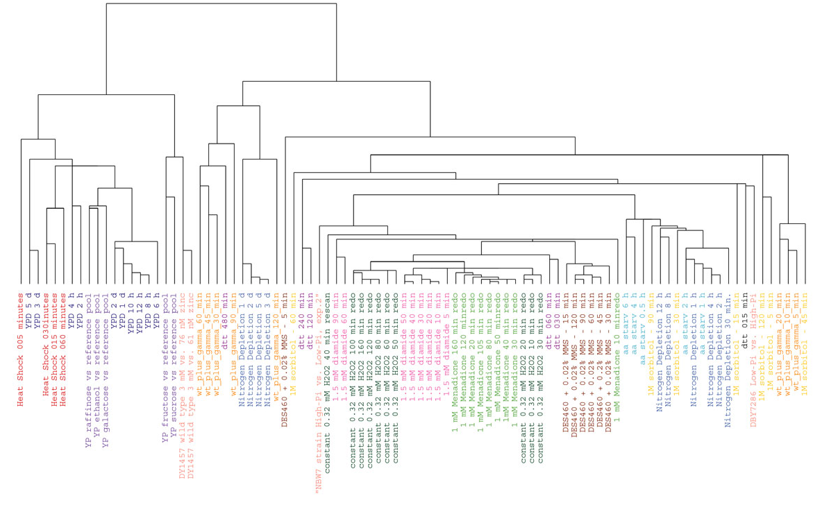
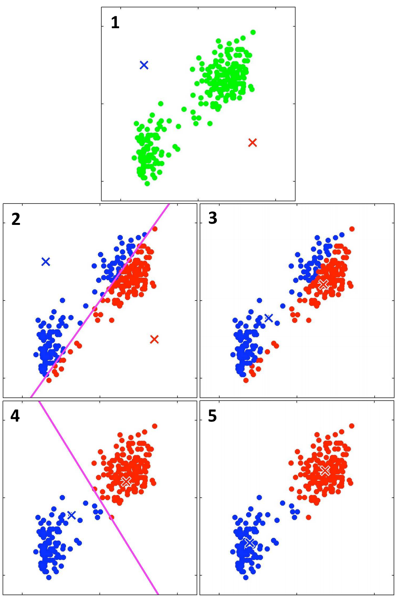

Clustering is an important technique in data science. It is similar to dimensionality reduction in two main ways:

1. Our goal with clustering is to find ways to *summarize* a large amount of data in a way that has interpretable meaning. Our goal is "descriptive, [not] predictive".[^desc]

[^desc]: Rokach and Maimon, "Data Mining and Knowledge Discovery Handbook", Ch. 13. This is a very good overview of techniques for clustering data.

2. Standard clustering is an *unsupervised* task, meaning that there is no "target variable" we can use to provide external validation of our results (unlike predictive modeling).

Our goal is to *group data together* so that similar data points are in the same cluster but dissimilar data points are in different clusters.

We will (1) begin with a broad theoretical overview of clustering, (2) move into some experiments with specific techniques and datasets, (3) learn about how to use bootstrapping to evaluate clusters and choose parameters, and (4) end with open-ended questions for you to explore on your own using clustering techniques.

Overview of clustering
======================

Standard clustering techniques can be divided into a couple major groups. We'll cover the three most commonly encountered ones at a general level before looking at how to use a representative of each one.[^num]

[^num]: There is an [enormous number](http://wiki.math.yorku.ca/index.php/R:_Cluster_analysis) of clustering packages available for R, but we will only consider the most commonly useful ones!

Hierarchical methods
--------------------

The first type of clustering technique consists of **hierarchical methods** which arrange data points into a tree-like structure called a [*dendrogram*](https://en.wikipedia.org/wiki/Dendrogram):



A specific clustering can be obtained by "cutting" the dendrogram off at the desired level of granularity. (Imagine drawing a horizontal line through the dendrogram and ignoring all of the splits in the dendrogram below that line.) This is one of the major advantages of hierarchical clustering -- the algorithm produces many nested partitionings of the data, and the user has the flexibility to choose any particular level of specificity or granularity.

They are also known to be very versatile, having good performance on many different types of clusters, and the number of clusters to look for need not be specified in advance. However, the main drawback to this generality is that these algorithms take a long time to run.[^compcost]

[^compcost]: For $n$ data points, the time complexity is at least $O(n^2)$, and for hierarchical *agglomerative* clustering, which will be covered in this document, it's $O(n^2 \log n)$!

Partitioning methods
--------------------

The second major type of clustering methods consists of **partitioning methods** where we specify the number of clusters *in advance* and iteratively reallocate points between clusters until the algorithm converges. (Ideally, we would like to consider every possible partitioning of points and pick the best one, but this is impossible because of the enormous number of possible partitionings -- which is why we must turn to approximate, iterative methods.)

The typical representative of this class is the $K$-means algorithm, which randomly starts with cluster centers and moves those cluster centers around in a particular way until their locations stop changing. Although the $K$-means algorithm is very fast, it is also sensitive to its initial configuration and cannot be used for all types of data. Finally, since every observation must be

Mixture models
--------------

With a mixture model, one specifies in advance a number of distributions (*e.g.*, Gaussians) from which the data is assumed to be drawn and then adjusts the parameters of those distributions such that the probability of seeing the observed data is maximized. Unlike a partitioning model, the clusters are not fully separate and can have nontrivial overlap.

Using a mixture model for clustering is implicitly equivalent to the imposition of a Bayesian prior about the shape of the distribution from which your data is drawn. (In practice, people use Gaussians for continuous data and multinomial distributions for categorical data.) The effectiveness of mixture model-based clustering is therefore highly dependent upon the extent to which those distributions represent the actual processes via which your data is generated.

One advantage of mixture models is that they are good at accommodating to outliers, whereas the presence of even a single outlier data point (which does not in actuality belong to any of the real clusters) can severely adversely affect the output of hierarchical clustering and $K$-means clustering.

Distance functions
==================

Since clustering is fundamentally about similarity and dissimilarity, it's important to first formalize the notion of what it means for two data points to be alike or different! We do so by defining *distance functions* -- formulas which tell us how to compute a number, a *distance*, for every pair of data points corresponding to how similar to dissimilar they are.

The concept of a *distance* is closely related but not identical to the concept of a [*norm*](https://en.wikipedia.org/wiki/Norm_(mathematics)). The norm is a precise mathematical concept which is a function of one vector and returns a nonnegative number, whereas a distance is a function of *two* vectors which returns a nonnegative number. Each norm induces a corresponding distance function -- the norm $n(\textbf{v})$ induces the distance function $d_n(\textbf{x},\textbf{y}) = n(x-y)$ -- but there are distance functions which have no equivalent norms, like a function $d(\textbf{x},\textbf{y})$ which is 0 if $\textbf{x} = \textbf{y}$ but 1 otherwise.

Let $\textbf{x} = (x_1, x_2, \ldots, x_n)$ and $\textbf{y} = (y_1, y_2, \ldots, y_n)$ in the following description of distance functions.

* The most commonly used distance is **Euclidean distance**, induced by the $L^2$ norm. It's defined as $d(\textbf{x},\textbf{y}) = \sqrt{(x_1 - y_1)^2 + (x_2 - y_2)^2 + \cdots + (x_n - y_n)^2}$. This is appropriate for continuously varying data, but not appropriate for categorical or binary data.

* When we have binary data (or categorical data, which can be expanded out into binary variables), we can use **Hamming distance**, defined as such: Let $h(a,b)$ be equal to 1 if $a = b$ and 0 otherwise. Then $d(\textbf{x},\textbf{y}) = \sum_i h(x_i,y_i)$.

	* Note that some categorical variables have a natural interpretation as continuous variables -- for instance, you could transform a categorical variable taking on values "short", "medium", and "tall" into the numerical values 1, 2, and 3, in which case you would be able to use a distance function for continuously varying data (such as the Euclidean distance).

* The **Manhattan distance** is induced by the $L^1 norm$ and is defined as $d(\textbf{x},\textbf{y}) = \left|x_1 - y_1\right| + \left|x_2 - y_2\right| + \cdots + \left|x_n - y_n\right|$. Intuitively, one can think of the Manhattan distance as being the number of city blocks you would have to travel to get from $x$ to $y$ if the 'streets' are laid out in a perfect grid -- indeed, that is the origin of its name (compare: [1](https://upload.wikimedia.org/wikipedia/commons/thumb/0/08/Manhattan_distance.svg/283px-Manhattan_distance.svg.png), [2](http://re-re.info/wp-content/uploads/2012/02/1828%20Lower%20and%20Dowtown%20Manhattan%20grid.jpg)).

* **Cosine similarity** is a distance function that measures the cosine of the *angle* between two vectors. From the identity $\textbf{x} \cdot \textbf{y} = \lVert \textbf{x} \rVert \lVert \textbf{y} \rVert \cos \theta$, we can derive an expression for $d(\textbf{x},\textbf{y}) = \cos \theta$. It is often used in high-dimensional data analysis problems, such as natural language processing, where the Euclidean distance metric is inapplicable or works poorly.

Using a different distance function will lead to different clusters, and some clustering methods can only be used with a specific distance function.

The `dist()` function in R will compute a matrix of distances between data points in an input matrix corresponding to a variety of different methods: `"euclidean"` (the $L^2$-induced distance), `"manhattan"` (the $L^1$-induced distance), and others.

Agglomerative hierarchical clustering
=====================================

The `hclust()` function in R provides access to hierarchical clustering. Specifically, it provides access to algorithms for *agglomerative* hierarchical clustering, in which each data point initially represents a single cluster and the clusters are successively merged.[^agglom]

[^agglom]: This is in contrast to *divisive* hierarchical clustering, in which objects initially all belong to a single cluster which is then successively divided into sub-clusters.

Getting started
---------------

To explore hierarchical clustering, we will be using the `protein` dataset, available as `protein.txt` with documentation in `protein_README.txt` or online at [CMU's Data and Story Library](http://lib.stat.cmu.edu/DASL/Datafiles/Protein.html). The dataset contains information about protein consumption (divided into various subgroups) for 25 European countries in 1973. Our goal will be to cluster countries together based on their protein consumption.

* Load the data into R with `readr`'s `read_delim()`. When specifying the delimiter, you can represent a tab character as `"\t"`.

* Scaling the data is important for clustering -- the "dimensions" you use for each variable will affect the clusters you get. Use `scale()` to scale the protein intake data, omitting the `Country` column. (Unless you have good reasons to preserve the dimensions of the original data, scaling everything to have standard deviation 1 is a good default step.)

* Set the `rownames()` of the scaled matrix equal to the `Country` column of the original dataframe.

Since our data is continuous, we'll default to using the *Euclidean distance*.

* Use `dist(..., method="euclidean")` to generate a distance matrix from your scaled data using the Euclidean distance function.

Using `hclust()`
----------------

Hierarchical clustering is provided as part of R's base packages in the `hclust()` function. We would like to use [Ward's method](https://en.wikipedia.org/wiki/Ward%27s_method) for agglomerative hierarchical clustering, which minimizes the total within-cluster variance.

* The `hclust()` function accepts a `method` parameter for selection of the specific agglomeration method. Read the "Details" section of the `hclust()` documentation to find out the difference between passing in `"ward"`, `"ward.D"`, and `"ward.D2"` for `method`.

* Use the correct input for the `method` parameter to run agglomerative hierarchical clustering with Ward's method on the scaled data. (You'll want to assign the output of `hclust()` to an variable.) Run `plot()` on the output and interpret the results.

If you want to consider a specific number of clusters, the `cutree(hclust(...), k)` function can be used to select the right cutoff point for the dendrogram so that you end up with `k` clusters.

* Load the following convenience function into R:

	```r
	print_clusters = function(labels, k) {             
	  for(i in 1:k) {
	    print(paste("cluster", i))
	    print(protein[labels == i, c("Country", "RedMeat",
	                                 "Fish", "Fr.Veg")])
	  }
	}
	```

* Use `cutree()` on the output of `hclust()` with `k=5` to split the countries into 5 clusters. Examine each cluster with `print_clusters()`, passing in the output of `cutree()` to `labels` and changing `k` from 2 through 5. Briefly inspect the results.

The `cluster` package contains a function, `clusplot()`, which can be used to visualize the results of clustering: it plots the data points on a 2-dimensional graph of their first two principal components and draws ellipses around the cluster assignments. When using `clusplot()`, the first argument should be your scaled data and the second argument should be the output of `cutree()`; for a nicer plot, also pass in `color=TRUE`, `shade=TRUE`, `labels=2`, and `lines=0`.

* Write a function `hclust_plot(d, method, k)` that takes in a distance matrix `d`, a hierarchical clustering method `method`, and a number of clusters `k`. It should call `hclust()` with the specified data and method, use `cutree()` to extract a specific clustering with `k` clusters, and then call `clusplot()` as specified above to make a cluster plot of the results.

* Run `hclust_plot()` on your data for `k` ranging from 2 to 5. Interpret the results.

Validating the clusters
-----------------------

We can visually interpret the tree and assign meaning to the clusters we see, but can we assign some level of statistical confidence to the output of `hclust()`? Yes: we can use *bootstrapping* (also known as *bootstrap resampling*) to do so. Intuitively: For a dataset with $n$ rows, we repeatedly sample $n$ of those rows *with replacement* and compute the resulting dendrogram. We then compare these dendrograms with the dendrogram obtained for the original data. In doing so, we can assign $p$-values to each split of the original dendrogram.

This method is implemented in the [`pvclust` package](http://www.sigmath.es.osaka-u.ac.jp/shimo-lab/prog/pvclust/) as `pvclust()`.

* Use `pvclust()` on your data with `method.hclust="ward.D2"` and `method.dist="euclidean"`. Note that `pvclust()` clusters columns and not rows, so you'll need to transpose your scaled matrix of data.

* Call `pvrect()` on the output of `pvclust()`, which defaults to highlighting the largest clusters with $p$-value $\le 0.05$. Read the [What is `pvclust`? section](http://www.sigmath.es.osaka-u.ac.jp/shimo-lab/prog/pvclust/) on its official page (and scroll down for some examples of nice dendrograms).

* Experiment with different values of the `alpha` parameter in `pvrect()`. (There are some graphical bugs with `pvrect()` -- you may need to plot something else in between every call of `pvrect()` with different parameters.) Interpret the results.

*K*-means clustering
====================

$K$-means clustering is a standard example of a *partitioning* clustering method. It is one of the fastest clustering methods, but it is sensitive to both its initial configuration and the presence of outliers.

The algorithm can be described as follows (for some specific choice of $K$):

1. *(Initialization)* Randomly choose locations for the $K$ cluster centers.
2. Assign each data point to the closest cluster center.
3. For each cluster, compute its *centroid* and set the cluster center equal to the centroid.
4. Repeat steps 2 and 3 until the locations of the cluster centers stop changing.

Here is a visual illustration of the algorithm:



Although only two iterations of the process are shown, the positions of the cluster centers will eventually converge.

*K*-means clustering is a method which implicitly minimizes within-cluster variance, which is defined using the Euclidean distance! As such, if non-Euclidean distance functions are used for computing cluster assignments and centroids in $K$-means clustering, the algorithm is not guaranteed to converge. As such, it is almost always used on continuous data.[^con] Thankfully, our protein consumption data is continuous!

[^con]: You can however [transform cosine distances into Euclidean distances](http://stats.stackexchange.com/a/81494/115666); in general, you can *sometimes* make other distance metrics work with $K$-means clustering.

Using `kmeans()`
----------------

$K$-means clustering is implemented in R as the `kmeans()` function.

* Run $K$-means clustering on the scaled protein consumption data, setting $K = 5$. Interpret the results and compare them to the results of hierarchical clustering. Experiment with different values of $K$ and note the differences.

* Write a function `kmeans_plot(data, k)` that takes in a data matrix `data` and a number of clusters `k`. It should run $K$-means clustering on the data with `k` clusters and then make a call to `clusplot()` to visualize the results. (The clustering data is stored in the `$cluster` parameter of the result of `kmeans()`.)

* Run `kmeans_plot()` multiple times with `k=5`. How stable are the results? What about with `k=2`?

Validating a choice of $K$
--------------------------

The `fpc` package has a function called `kmeansruns()`, which will run $K$-means clustering over a range of values for $K$. For each value of $K$, it will run the algorithm from multiple random starting positions and calculate a metric of clustering quality, either the Calinski-Harabasz index or the average silhouette width.

* Use `kmeansruns()` to test values of $K$ from 1 to 10 with `criterion="ch"` for the Calinski-Harabasz index. Read the documentation to see how to change the criterion to the average silhouette width and run `kmeansruns()` using that criterion as well.

* Plot the two clustering quality critera, stored in the output of `kmeansruns()` as `$crit`, against $K$. What is the optimal value of $K$? (A higher value on either criterion corresponds to higher clustering quality.)[^kval]

[^kval]: The position of the global maximum in both plots suggests that $K = 2$ is ideal, but the local maximum in the graph of average silhouette width is suggestive of $K = 5$ being a viable candidate as well.

Mixture models
==============

With a mixture model, one asks the following question: Suppose that our data is *generated* via some process. Indeed, suppose that we have a variety of different underlying *distributions*, and the data we observe is sampled from those distributions. If so, what parameters of those underlying distributions maximize the probability of observing the observed data?

If we are able to answer this question, we can then treat those distributions as different *clusters* of data. Since these distributions will usually decay continuously and smoothly from their center, they *mix* together (think of two overlapping normal distributions).

Getting started
---------------

For a simple example of how mixture models can be applied, we'll look at the distribution of [waiting times between Old Faithful eruptions](https://stat.ethz.ch/R-manual/R-devel/library/datasets/html/faithful.html).

* Load the `datasets` package and set `df_faithful = faithful`. Call `qplot()` on `df_faithful$waiting` to see a histogram of the waiting times between Old Faithful eruptions. How many clusters does this data seem to have? Is it appropriate to model waiting times as being generated by a mix of Gaussians? What about for the eruption durations (in `$eruption`)?

First, we'll model our data as a mixture of normal distributions, also called "Gaussians".

* Load the `mixtools` package and call `normalmixEM()` on the column containing waiting times. Next, `plot()` the output of `normalmixEM()` with `density=TRUE`. Interpret the results.

	* The first plot is of the *log-likelihood*, which the function tries to iteratively maximize by adjusting the parameters of the Gaussian distributions. The second plot is a plot of the Gaussian density components of the mixture model overlaid on top of a histogram of the data.

The `normalmixEM()` function uses an [expectation-maximization (EM) algorithm](https://en.wikipedia.org/wiki/Expectation%E2%80%93maximization_algorithm) to maximize the log-likelihood. The details of the EM algorithm are beyond the scope of this lesson, but there are two important points to know:

1. The EM algorithm may not converge. Whether or not it will converge can be highly dependent on what problem it's applied to.

2. Since the EM algorithm is iterative, it requires starting values for its parameters. (We didn't pass any to `normalmixEM()`, so it randomly chose them and defaulted to 2 constituent Gaussians.) The performance and convergence of the EM algorithm can be highly dependent on the initialization settings.

For this reason, it's important to visualize your data to get a sense of what initial settings to pick -- otherwise, your results may be nonsensical!

* You can use `summary()` to view the parameters of your Gaussian model mixture. Rerun `normalmixEM()` a few times on the waiting times data; how much variation do you observe in the values of the final parameter as well as the number of iterations required for convergence?

* The `k` parameter of `normalmixEM()` controls the number of Gaussians it tries to fit to your data. What happens if you set `k=3`? Try it a couple times, plotting the results each time. (You can pass `which=2` into `plot()` to show just the second plot.)

However, the assumption that our data points are all generated from normal distributions is quite strong. We would like to relax our assumptions if possible, and we can fit our data to a mixture of *semiparametric* models, where we assume only that the underlying distributions have densities symmetric around their center. We must also specify a desired *bandwidth*, which controls the degree of complexity allowed in our semiparametric models.

We can use the `spEMsymloc()` function in `mixtools` to do semiparametric fitting of univariate symmetric density functions to our mixture.[^leb] The `mu0` parameter controls the *number* of models to fit and the `bw` parameter controls the *bandwidth* of our method.

[^leb]: To be precise, the specific stochastic algorithm implemented in `spEMsymloc()` is from Bordes *et al.* (2007) and relies on the additional assumption that the densities are absolutely continuous with respect to Lebesgue measure.

* Use `spEMsymloc()` to create mixture models of the waiting time between Old Faithful eruptions. Experiment with different values of `mu0` and `bw`, plotting them as you go. Interpret the results.

Fitting the protein consumption data
------------------------------------

W

Closing notes
=============

Here are some final takeaways about clustering:

* Clustering is an unsupervised technique which is very iterative and interactive. It's not as easily automatable as doing predictive modeling with a suite of different algorithms.

* Distance metrics matter, and so distance matters as well -- don't forget to `scale()` your data.

* Complicated graphical manipulation of dendrograms can be done using the [`dendextend` package](https://cran.r-project.org/web/packages/dendextend/vignettes/introduction.html).

* There are a variety of ways to evaluate the quality of a particular clustering of the data. It may be generally helpful to consider the output of multiple different clustering methods and to see how they agree.

Problems with high dimensionality
---------------------------------

In general, machine learning techniques have problems with high dimensions. For clustering in particular, Steinbach *et al.* say (in [The Challenges of Clustering High Dimensional Data](http://www-users.cs.umn.edu/~kumar/papers/high_dim_clustering_19.pdf)):

> For clustering purposes, the most relevant aspect of the curse of dimensionality concerns the effect of increasing dimensionality on distance or similarity. In particular, most clustering techniques depend critically on the measure of distance or similarity, and require that the objects within clusters are, in general, closer to each other than to objects in other clusters. (Otherwise, clustering algorithms may produce clusters that are not meaningful.)
> 
> In [Beyer *et al.* (1999)], it is shown, for certain data distributions, that the relative difference of the distances of the closest and farthest data points of an independently selected point goes to 0 as the dimensionality increases ...
> 
> For example, this phenomenon occurs if all attributes are i.i.d. (identically and independently distributed). Thus, it is often said, "in high dimensional spaces, distances between points become relatively uniform." In such cases, the notion of the nearest neighbor of a point is meaningless.

However, all is not lost! Among other tools, can use *dimensionality reduction techniques* to overcome the *curse of dimensionality*. The most straightforward way would be to take the first $k$ principal components of your dataset, discard the rest, and perform cluster analysis using only those $k$ components. Of course, more complex techniques exist.

Advanced methods
----------------

More recent advances in cluster analysis have resulted in a number of powerful techniques for clustering. In particular, genetic algorithms, simulated annealing, Tabu search, randomized branch-and-bound, and hybrid search have all be found to perform approximately as well as each other.[^comp] However, these methods all require high amounts of computational time.

[^comp]: See [Computational experience on four algorithms for the hard clustering problem](http://www.sciencedirect.com/science/article/pii/0167865595001220) by Al-Sultana and Khan (1996) and [An empirical study of the performance of heuristic methods for clustering](https://books.google.com/books?id=sbajBQAAQBAJ&pg=PA425&lpg=PA425&dq=An+empirical+study+of+the+performance+of+heuristic+methods+for+clustering&source=bl&ots=KdJOXmA4vq&sig=pC4LrYF81va7KsZeC29RQp_g894&hl=en&sa=X&ved=0ahUKEwjynPj07PbMAhVJ42MKHbaTBQ4Q6AEIIzAB#v=onepage&q=An%20empirical%20study%20of%20the%20performance%20of%20heuristic%20methods%20for%20clustering&f=false) by Mishra and Raghavan (1994).

The $K$-means algorithm (and the [Kohonen net](https://en.wikipedia.org/wiki/Self-organizing_map), an analogue of $K$-means with artificial neural networks) will converge to a locally optimal solution but is sensitive to initialization parameters; as such, for large data sets, it may be feasible to use a more complex algorithm to obtain an initial partitioning and to then pass that partitioning into the $K$-means algorithm for a starting position.

Clustering on the LessWrong dataset
===================================

Try out the clustering methods on the LessWrong dataset. Note your findings!

You may want to do factor analysis on subsets of the questions and then cluster based on those factor scores instead of clustering based on the original question responses themselves.