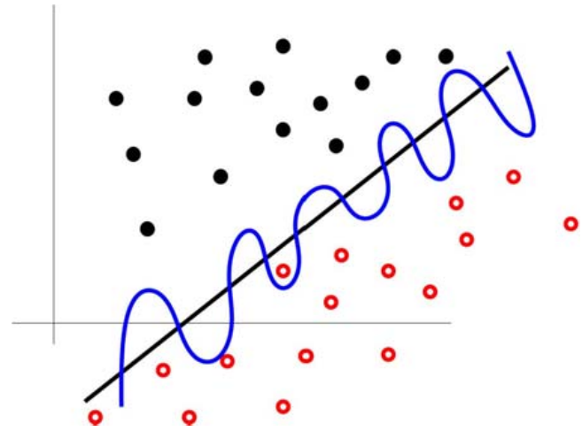

Although you have already been introduced to classification via logistic regression, we will develop the theory of classification in general in greater detail.

We will begin with some theoretical exposition and then move into a series of exercises with different classification techniques.

Overview
========

The task of *classification* is fundamental to the history and development of machine learning because the simplest machine learning problem possible is binary classification: determining whether data falls into one class or the other.

The structure of classfier theory
---------------------------------

The novice data scientist can easily fall into the trap of considering different techniques to be more-or-less disconnected and unrelated, as if machine learning were a "grab bag" of models and algorithms, each with its own odd little quirks and nuances. This is not the case! There is **structure** in this world.

Of particular importance is the distinction between **generative vs. discriminative** approaches. A generative approach models the way in which the observed data were generated in order to perform classification on new data, whereas a discriminative approach doesn't care about how the data was generated: it is *purely* concerned with the problem of classifying new data.

To make this precise, suppose that we wish to predict the label $y$ from the training data $x$. In a *discriminative* approach, we are concerned with evaluating $y^\star = \mathop{\mathrm{arg\, max}}_y P(y|x)$, that is, finding the most likely class label $y^\star$ given the data $x$. The only concern is how we can distinguish one class from another using $x$.

However, we can use Bayes' rule to rephrase our problem. Since $P(y|x) = P(x|y) P(y) / P(x)$, we have $y^\star = \mathop{\mathrm{arg\, max}}_y P(x|y)P(y)/P(x)$. However, the value of $y$ which maximizes $P(x|y)P(y)/P(x)$ is the same as the value of $y$ which maximizes $P(x|y)P(y)$, because $P(x)$ does not change with $y$.

As such, we can reformulate the problem as the evaluation of $y^\star = \mathop{\mathrm{arg\, max}}_y P(x|y) P(y)$. This corresponds to a *generative* model, because we are directly estimating the value of $P(y)$, that is, explicitly modeling the distribution of each class in order to perform classification.

### Philosophical importance

Instead of just being two equivalent formulations of the same underlying problem, the distinction between generative and discriminative modeling is very philosophically fundamental. To quote [V. N. Vapnik](https://en.wikipedia.org/wiki/Vladimir_Vapnik):

> The philosophy of science has two different points of view on the goals and the results of scientific activities.
> 
> 1. There is a group of philosophers who believe that the results of scientific discovery are the real laws that exist in nature. These philosophers are called the *realists*.
> 
> 2. There is another group of philosophers who believe the laws that are discovered by scientists are just an instrument to make a good prediction. The discovered laws can be very different from the ones that exist in Nature. These philosophers are called the *instrumentalists*.
> 
> The two types of approximations defined by classical discriminant analysis (using the generative model of data) and by statistical learning theory (using the function that explains the data best) reflect the positions of realists and instrumentalists in our simple model of the philosophy of generalization, the pattern recognition model. Later we will see that the position of philosophical instrumentalism played a crucial role in the success that pattern recognition technology has achieved.

Considering classification alone, we can state this in a more precise fashion. Suppose that we have a black box, $\mathcal{B}$, which when given an input vector $\textbf{x}_i$ returns an output $y_i = {-1,+1}$. Given the training data $(y_i, \textbf{x}_i)$, $i = 1, \ldots, n$, the task of *binary classification* is to find a function which best approximates whatever rule the black box $\mathcal{B}$ is internally using to perform the operation $\textbf{x}_i \mapsto y_i$.

There are two different ideas of what a *good approximation* means:

1. A good approximation of $\mathcal{B}$ is a function that is *similar in function space*, like how $\sin 2x$ is similar to $\sin 2.1x$, to the function which $\mathcal{B}$ uses to map $\textbf{x}_i \mapsto y_i$.
2. A good approximation of $\mathcal{B}$ is a function that is *numerically similar* to the function which $\mathcal{B}$ uses, giving approximately the same error rate of classification as $\mathcal{B}$ itself.

The first definition is concerned with approximating the *true function*. The second definition is only concerned with *minimizing the error rate*.

### Practical importance

This distinction is not just of philosophical importance; it carries practical significance:

> [I]ll-posed problems can occur when one tries to estimate *unknown reasons from observed consequences*.

That is to say, problems that are very computationally difficult to solve -- where a small change in the observed data can lead to (discontinuously) large changes in the solution -- are very often precisely the problems which occur when we try to use a *generative* model. If the solver possesses "very strong prior knowledge about the solution", or if the solver makes very strong prior *assumptions*, then generative models become much more tractable, but this is not always feasible.

Vapnik writes:

> Keeping in mind the structure of ill-posed problems our problem of finding the [solution for $\mathcal{B}$] can be split into two stages:
> 
> 1. Among a given set of admissible functions find a subset of functions that provides an expected loss that is close to the minimal one.
> 2. Among functions that provide a small expected loss find one that is close to the $\mathcal{B}$ function.
> 
> The first stage does not lead to an ill-posed problem, but the second stage might (if the corresponding operator is unstable).
> 
> The realist view requires solving both stages of the problem, while the instrumentalist view requires solving only the first stage and choosing for prediction any function that belongs to the set of functions obtained.

The shift from the realist view to the instrumentalist view marked a significant advance in the development of machine learning.

Evaluation of classifier performance
------------------------------------

* Read [Nina Zumel's primer](http://win-vector.com/dfiles/StatisticsToEnglishPart1_Accuracy.pdf) on the evaluation of classifier performance.

Perceptrons
===========

 We will begin by considering the **perceptron algorithm**, one of the first and simplest classification techniques ever developed.

* Read about the history of the perceptron on [Wikipedia](https://en.wikipedia.org/wiki/Perceptron#History).

Getting started
---------------

First, we have to generate linearly separable data. For simplicity, we will restrict attention to the unit square ($x \in [0,1]$, $y \in [0,1]$).

* Write a function `lin_pair(m, b, label)` that takes in integers `m`, `b`, and `label` and returns two numerics `c(x, y)` satisfying the following criteria:

	* Both `x` and `y` should be between 0 and 1.

	* If `label` is set to 1, then `y` must be greater than `m*x + b`. Conversely, if `label` is set to -1, then `y` must be less than `m*x + b`.

You can think of the function `lin_pair(m, b, label)` as picking a point in the unit square uniformly randomly from the region falling above or below the line $y = mx + b$.

* Generate 1000 data points falling above the line $1.5x + 0.2$ and 1000 data points falling below the line $1.5x + 0.05$, binding them into the same matrix.

* Create a `labels` vector where the $i$th entry is 1 or -1 according to whether the $i$th data point in the matrix was generated with `label=1` or `label=-1`. Graph the results with `qplot()`, using the `color=labels` parameter to color the points.

* Add a column to your matrix of data consisting purely of 1s (the perceptron algorithm needs this to work properly).

For each point $\textbf{x}_i$, the perceptron algorithm forms an augmented point $\textbf{x}_i' = (\textbf{x}, 1)$. It works by updating a vector of *weights* $\textbf{w}$ step-by-step as it iterates over the augmented data points, adjusting the weights whenever it encounters a training point which it misclassifies. To perform classification, it looks at the *sign* of $\textbf{w} \cdot \textbf{x}_i'$, classfiying positive results as 1 and negative results as -1.

* Write a function `dot(x, y)` which computes the [dot product](https://en.wikipedia.org/wiki/Dot_product) between the vectors `x` and `y`, denoted as $x \cdot y$. It is equal to the sum of $x_1y_1 + x_2y_2 + \cdot + x_ny_n$.

* Write a function `perceptron(xs, y, w, rate, niter)` following these specifications:

	* Take as input a matrix of data `xs`, a vector of labels (1 or -1) `y`, a vector of weights `w`, a learning rate `rate`, and a number of iterations `niter`. `niter` should default to the number of data points.

	* Generate `niter` random indices from the row indices of the data, sampled *without* replacement.

	* For each sampled row, do the following: For convenience, call the sampled row `xi`. Compute the *dot product* between `xi` and `w`. The classification of `xi`, according to the perceptron, is the `sign()` of the dot product. If the classification is a false negative, update `w` by adding `rate * xi`, and if the classification is a false positive, update `w` by subtracting `rate * xi`.

	* Return the weights after the `niter` iterations have finished.

Visualizing your results
------------------------

The weights of the perceptron parametrize a *line* given by `w[1] * x + w[2] * y + w[3] = 0`. This is called the *decision boundary*.

* What are the slope and $y$-intercept of this line in terms of the components of `w`?

* Set the seed for consistency and try `perceptron()` on your generated data with `rate=1` and the default value for `niter`. You should initialize the weights vector to a vector of zeroes and then pass in the output of the first `perceptron()` call to the initial weights of the next. After each call to `perceptron()`, plot the *decision boundary* corresponding to your results overlaid on top of the scatterplot of data points by adding a `geom_abline()` call with the `intercept` and `slope` parameters.

A perceptron is *guaranteed to converge* to a line which fully separates two class *if* the two classes are linearly separable. If a perceptron converges to a solution, that means that it will correctly classify all of the training data.

* Write a function `perceptron_conv()` which takes in all the arguments of `perceptron()` aside from `niter`. It should run `perceptron()` until the solution converges. It should return a list with the final weights as well as the number of total iterations (it's fine if the number of iterations is an overestimate).

* Set the seed for consistency and plot the decision boundary which `perceptron_conv()` gives you for your output. Try a variety of different seeds. How much variation do you observe?

* How does the learning rate of the perceptron affect the speed of convergence for your current data? What if you have 20 data points (generated in the same way) instead of 2000?

Congratulations: you have successfully implemented one of the classic algorithms of machine learning. It even counts as a neural network (with a single neuron)! Unfortunately, the standard perceptron cannot classify data which is not linearly separable, because the algorithm will simply not converge.

Also, as you have seen, when it *does* converge, the perceptron's solution is highly dependent upon choice of random seed. When the training data is linearly separable *and* there exists a "gap" or "margin" between them, there are infinitely many possible choices of a valid decision boundary. We will see later how to resolve these problems.